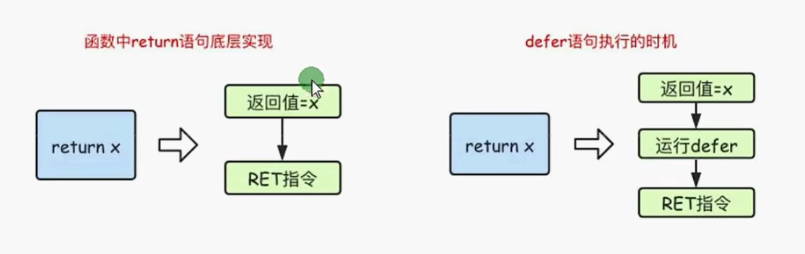
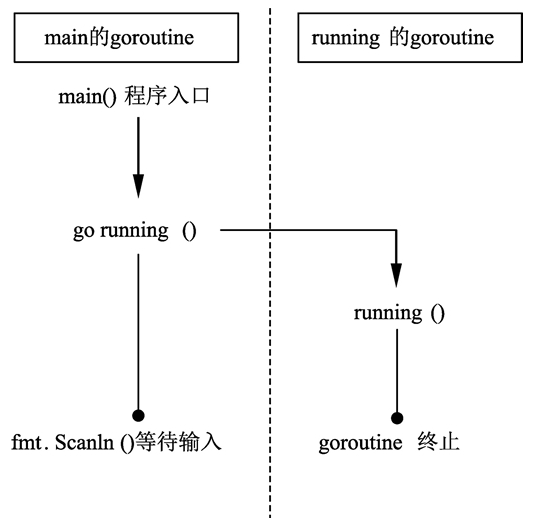

# Golang

## 一、环境配置及HelloWrold

### 1.1 环境配置

+ 从官网上下载.msi安装，下载地址：https://golang.google.cn/dl/

+ 下载完成之后点击.msi文件进行默认安装（默认安装路径：C:\Program Files\Go）

+ 安装完成之后通过命令行判断是否安装成功：输入命令`go version`

  ```
  C:\Users\USER>go version
  go version go1.20 windows/amd64
  ```

> **GOPATH和GOROOT**
>
> GOROOT就是GO语言的安装目录，在Windows中默认是C:\Program Files\Go，在绝大部分情况下不需要修改
>
> 在 Go 语言中，GOPATH 是一个环境变量，`用于设置 Go 语言代码的工作目录`，GOPATH可以设置多个。
>
> **GOPATH的作用**
>
> GOPATH是开发时的工作目录，用于：
>
> + 保存编译后的二进制文件
> + go get和go install命令下载的go代码到GOPATH
> + import包时的搜索路径（在使用GOPATH时，GO会在一下目录中搜索包：GOROOT/src，该目录保存了Go标准库的代码; GOPATH/src该目录保存了应用自身代码和第三方依赖库的代码）
>
> **GOPATH的目录结构**
>
> GOPATH是作为项目的根目录结构，包含3个重要的目录：
>
> + src --- Golang项目的主要源代码目录
> + pkg --- Golang项目所需要的库
> + bin --- Golang项目的二进制文件可执行文件

**设置镜像源**

从 1.13 版本开始 Go 官方就推荐使用 go module 的方式进行依赖管理，但是因为“墙”的存在，导致有些外网的包可能无法下载或者下载速度会很慢，所以需要配置国内的镜像源

```
#在命令行中通过go命令设置镜像源
go env -w GO111MODULE=on
go env -w GOPROXY=https://goproxy.cn,direct
```

### 1.2 HelloWorld

在GOPATH目录结构新建src、pkg、bin目录，在src目录下新建代码目录，比如base-study，在base-study终端目录下输入go mod init baseStudy命令初始化模块，在下面新建代码目录，并编写HelloWorld代码：

```go
package main   //声明每个go文件所属的包，每个go文件必须要有归属的包，主函数所属的包一定是main包
 
import "fmt"   //引入程序中需要的包，为了使用包下的函数，类似与Java的import java.xxx.xx

func main() {   //main函数，程序主入口
	fmt.Println("Hello World")    //在控制台打印输出一句话
}
```

使用go命令运行程序，go程序有很多中运行方式：

+ 使用go run命令，在命令提示符旁输入`go run workspacepath/src/hello/helloworld.go`，在控制台会直接输出Hello World
+ 使用go build命令编译HelloWorld.go代码，会在包目录下生成HelloWorld.exe的可执行文件，可以直接运行可执行文件

## 二、Golang基础语法

### 2.1 Golang是什么

Golang是由谷歌开发的一个开源的编译型的静态语言。

Golang 的主要关注点是使得**高可用性和可扩展性**的 **Web 应用**的开发变得简便容易。（译注：Go 的定位是系统编程语言，**只是对 Web 开发支持较好**）

> **为什么选择Golang**
>
> 以下是Go语言的一些优点：
>
> - 并发是语言的一部分（译注：并非通过标准库实现），所以编写多线程程序会是一件很容易的事。
> - Golang是一种`编译型语言`。源代码会编译为二进制机器码。而在解释型语言中没有这个过程，如 Node.js 中的 JavaScript。
> - 语言规范十分简洁。所有规范都在一个页面展示
> - Go编译器支持静态链接。所有 Go 代码都可以静态链接为一个大的二进制文件（译注：相对现在的磁盘空间，其实根本不大），并可以轻松部署到云服务器，而不必担心各种依赖性。

### 2.2 Go变量声明

Go的变量声明有四种形式：

```go
//声明单个变量
package main
/*四种变量的声明方式*/
import "fmt"
func main() {  
	//方式一：声明一个变量，默认值是0
	var a int   
	fmt.Println("a = ", a)
	//方式二：声明一个变量，并初始化
	var b int = 10
	fmt.Println("b = ", b)
	//方式三：在初始化时，可以省去数据类型，通过值自动匹配当前变量的数据类型（不推荐）
	var c = 20
	fmt.Println("c = ", c)
	fmt.Println("c type is %T", c)  //可以通过这段代码打印出变量c的类型
	//方式四：省去var关键字，直接自动匹配
	d := 30
	fmt.Println("d = ", d)
	fmt.Printf("d type is %T\n", d)
}
```

> 在声明全局变量的时候，方式一、二、三都可以，但方式四（:=的方式）不能声明全局变量，只能在函数体内声明变量

声明多个变量：

```go
//多变量声明
package main
import "fmt"
func main() {  
	//声明多个变量，每个变量的类型相同
	var xx, yy int = 100, 200
	fmt.Println("xx = ", xx, ", yy = ", yy)

	//声明多个变量，变量类型不同
	var kk, ll = 100, "hello"
	fmt.Println("kk = ", kk, ", ll = ", ll)

	//多行多变量声明
	var (
		vv int = 100
		jj bool = true
		mm string = "tek"
	)
	fmt.Println("vv = ", vv, ", jj = ", jj, ", mm = ", mm)
}
```

Go的基本数据类型包含一下几种：

- bool
- 数字类型
  - int8(8位有符号整数，-128~127), int16(16位有符号整数，-32768～32767), int32(32位有符号整数，-2147483648～2147483647), int64(64位有符号整数，-9223372036854775808～9223372036854775807), int(根据底层平台表示32位或64位有符号整型)
  - uint8(8位无符号整型，0~255), uint16(16位无符号整型，0～65535), uint32(32位无符号整型，0～4294967295), uint64(64位无符号整型，0～18446744073709551615), uint(根据底层平台表示32位或64位无符号整型)
  - float32(32位浮点数), float64(64位浮点数)
  - complex64(实部和虚部都是float32的复数), complex128(实部和虚部都是float64的复数)
  - byte(uint8的别名)
  - rune(int32的别名)
- string(字符串类型)

> Go 有着非常严格的`强类型特征`，Go 没有自动类型提升或类型转换。
>
> ```go
> a := 10
> b := 10.12
> c := a + b // 代码会报错，不允许int 和 float64进行加法运算
> d := a + (int)b //这样代码不会报错，需要手动进行数据转换
> ```

### 2.3 Go常量声明

Go语言使用const进行常量的声明，使用const声明的常量在后续的代码中不允许进行修改

```go
package main

import "fmt"

//const可以用来定义枚举类型
const (
	// BEIJING = 0
	// SHANGHAI = 1
	// SHENZHEN = 2
	//========================================================================
	//同时在const()定义中允许使用iota，每行的iota都会累加1，第一行的iota默认值是0
	// BEIJING = iota
	// SHANGHAI
	// SHENZHEN
	//========================================================================
	//可以对iota进行简单的计算
	BEIJING = 10 * iota + 1
	SHANGHAI
	SHENZHEN
)

//iota以行计算，每行递增
const (
	a, b = iota + 1, iota + 2  //第一行iota = 0， a = 1, b = 2
	c, d                       //第二行iota = 1， c = iota + 1, d = iota + 2, c = 2, d = 3
	e, f                       //第三行iota = 2， e = iota + 1, f = iota + 2, e = 3, f = 4
	//iota逐行累加，不会因为公式的改变而从0开始
	g, h = iota * 2, iota * 3 //第四行iota = 3， g = iota * 2, h = iota * 3, g = 6, h = 9
	i, j                      //第五行iota = 4， i = iota * 2, j = iota * 3, i = 12, j = 15
)

//Go常量定义
func main() {
	//常量只读
	const length int = 10
	fmt.Println("length = ", length)
	// length = 100

	fmt.Println("BEIJING = ", BEIJING)
	fmt.Println("SHANGHAI = ", SHANGHAI)
	fmt.Println("SHENZHEN = ", SHENZHEN)

	fmt.Println("a = ", a, " b = ", b)
	fmt.Println("c = ", c, " d = ", d)
	fmt.Println("e = ", e, " f = ", f)
	fmt.Println("g = ", g, " h = ", h)
	fmt.Println("i = ", i, " j = ", j)
}
```

> iota只能在const括号中使用
>
> 常量的声明不允许使用计算式，比如const b = math.Sqrt(4)
>
> 在声明字符串常量时需要明确指明字符串类型：const hello string = "hello"

### 2.4 函数

在Go语言中，函数的通用声明模板如下：

```go
func functionname(parametername type) returntype {  
    // 函数体（具体实现的功能）
}
```

Go语言的函数与其他语言不同，可以有多个返回值：

```go
package main

import "fmt"

//声明函数，单返回值函数
func foo1(a string, b int) int {
	fmt.Println("a =", a)
	fmt.Println("b =", b)

	c := 100
	return c
}

//声明函数，多返回值
func foo2(a string, b int) (int, int) {
	fmt.Println("a =", a)
	fmt.Println("b =", b)

	return 666, 777
}

//返回多个返回值，可以有形参名
func foo3(a string, b int) (r1 int, r2 int) {
	fmt.Println("foo3()====")
	fmt.Println("a =", a)
	fmt.Println("b =", b)

	r1 = 1000
	r2 = 2000
	return r1, r2
}
func main() {

	index := foo1("abc", 20)
	fmt.Println("index =", index)

	ret1, ret2 := foo2("hello", 40)
	fmt.Println("ret1 =", ret1, "ret2 =", ret2)

	fRet1, fRet2 := foo3("world", 50)
	fmt.Println("fRet1 =", fRet1, "fRet2 =", fRet2)
}
```

> Go语言中有一个特殊的空白符`_`可以用作表示任何类型的任何值。空白符可以用来跳过函数返回值中不需要的返回结果
>
> ```go
> _, res := foo3("world", 50)  //foo3函数的第一个返回值就会被忽略
> ```
>
> 可变参数函数，可变参数必须是函数的最后一个参数：
>
> ```go
> //c为byte类型的可变参数
> func foo(a int, b string, c ...byte) {    
> }
> 
> //函数的调用：
> foo(1,2,3,4,5)  //3,4,5均为可变参数的一部分
> ```

### 2.5 Go包 Package

`包用于组织 Go 源代码，提供了更好的可重用性与可读性`。由于包提供了代码的封装，因此使得 Go 应用程序易于维护。

main函数和main包：**所有可执行的 Go 程序都必须包含一个 main 函数**。这个函数是程序运行的入口。main 函数应该放置于 main 包中

创建自定义包：

```go
package lib1   //定义包名

import "fmt"

//lib1包下提供的接口函数
func Lib1Test() {
	fmt.Println("lib1Test()...")
}
```

在main包中引用自定义包：

```go
package main

//go语言默认会从GOPATH路径下的src目录中查找指定的包，所以需要指定包名的相对路径
import (
	"GolangStudy/init-package/lib1"   
	"GolangStudy/init-package/lib2"
)

func main() {
	lib1.Lib1Test()
	lib2.Lib2Test()
}
```

**init()函数**

所有包都可以包含一个 `init` 函数。init 函数不应该有任何返回值类型和参数，在我们的代码中也不能显式地调用它。init 函数的形式如下：

```go
func init() {
}
```

init 函数可用于执行初始化任务，也可用于在开始执行之前验证程序的正确性。init函数的执行流程：


如果一个包导入了另一个包，会先初始化被导入的包。尽管一个包可能会被导入多次，但是它只会被初始化一次。

之前提到过Go中会有空白符`_`，可以用作表示任何类型的任何值；在Go中导入了包，却不在代码中使用它是非法的，可以通过空白符屏蔽这一错误：

```go
package main

import "GolangStudy/lib1"

var _ = lib1.Lib1Test()

func main() {
}
```

有时候我们导入一个包，只是为了确保它进行了初始化，而无需使用包中的任何函数或变量。例如，我们或许需要确保调用了 rectangle 包的 init 函数，而不需要在代码中使用它。这种情况也可以使用空白标识符，如下所示:

```go
package main 

import (
    _ "geometry/rectangle" 
)
func main() {
}
```

同时在导入包时可以给导入的包起别名，然后通过别名调用函数：

```go
import (
	mylib1 "GolangStudy/lib1"
)

func main() {
    mylib1.Lib1Test()
}
```

> 在包中定义函数时，有一个规定：
>
> + 如果在定义函数时，函数名首字母大写，则当前函数可以用于被任何包中的函数调用(相当于Java中的public)
> + 如果在定义函数时，函数名首字母小写，则当前函数只能被包内的函数调用(相当于Java中的private)

### 2.6 Go指针

Go中的指针与C语言中的指针类似：指针是一种存储变量内存地址（Memory Address）的变量

> go语言中的指针不能进行偏移和运算，因此go语言中的指针操作很简单，只有`&`和`*`

声明一个指针变量：

```go
func main() {
	var a int = 10
	var b *int = &a
	fmt.Printf("b type: %T, b = %v\n", b, b)
}

输出：
b type: *int, b = 0xc00009e058
```

向函数传递指针参数：

```go
package main

import "fmt"

//传入参数为指针类型
func changeValue(value *int) {
	*value = *value + 10
}

func main() {
	var a int = 10

	changeValue(&a)

	fmt.Println("a = ", a)
}
输出：a = 20
```

如果想要向函数中传入数组，最好使用切片的形式，而不是使用数组指针

```go
package main

import "fmt"

func changeArray(nums []int) {
	nums[0] = 10
}

func main() {
	array := [...]int{1, 2, 3, 4, 5, 6, 7, 8}
    //传入数组切片
	changeArray(array[:])
	fmt.Println(array)
}
输出：[10 2 3 4 5 6 7 8]
```

**new()和make()**

在Go语言中对于引用类型的变量，在使用的时候不仅要声明它，还要为它分配内存空间，否则值就没办法存储。而对于值类型的声明不需要分配内存空间，是因为它们在声明的时候已经默认分配好了内存空间。Go语言中new和make是内建的两个函数，主要用来分配内存

```go
/*
* Type表示类型，new函数只接受一个参数
* *Type表示类型指针，new函数返回一个指向该类型内存地址的指针
*/
func new(Type) *Type
```

```go
/*
* make也是用于内存分配，只用于slice(切片)、map以及channel的内存创建
* make返回的类型就是这三个类型本身，并不是他们的指针类型，因为这三种类型就是引用类型
*/
func make(t Type, size ...IntegerType) Type
```

### 2.7 Go defer关键字

Go语言中的defer语句会将其后面跟随的语句进行延迟处理，在defer归属的函数即将返回时，将延迟处理的语句按defer定义的逆序进行执行，也就是说，先被defer的语句最后被执行，最后被defer的语句最先被执行

defer(延时)类似于Java中的final关键字，在所有代码执行完毕之后执行，一般都会用于资源的释放操作，比如defer file.close()：

```go
package main

import "fmt"

func main() {
	defer fmt.Println("main:: end")
	fmt.Println("main:: go 1")
	fmt.Println("main:: go 2")
}
执行结果：
main:: go 1
main:: go 2
main:: end
```

如果有多个defer，会先执行最后一个defer所定义的语句或者函数，比如：

```go
package main

import "fmt"

func func1() {
	fmt.Println("func1")
}

func func2() {
	fmt.Println("func2")
}

func func3() {
	fmt.Println("func3")
}

func main() {
	defer func1()   //最后执行
	defer func2()
	defer func3()   //最先执行
}
执行结果：
func3
func2
func1
```

defer在执行之前会将defer后的表达式或者函数依次入栈，然后在执行时依次出栈执行


defer与return的执行顺序，如果在函数中同时有defer和return，那么defer所定义的表达式会在return语句之后执行：

```go
package main

import "fmt"

func deferFunc() int {
	fmt.Println("deferFunc")
	return 0
}

func returnFunc() int {
	fmt.Println("returnFunc")
	return 0
}

func deferAndReturnFunc() int {

	defer deferFunc()
	return returnFunc()
}

func main() {

	deferAndReturnFunc()

}
执行结果：
returnFunc
deferFunc
```

> defer执行的时机：
>
> + 在go语言的函数中return语句在底层并不是原子操作，它分为给返回值赋值和RET指令两步，而defer语句执行的时机就在返回值赋值操作后，RET指令执行前：
>
>   

### 2.8 Go 数组

Go数组的定义与遍历方法：

```go
package main

import "fmt"

func main() {
	//定义一个固定长度的数组，默认元素全是0
	var array1 [10]int
	//定义一个固定长度的数组，前四个元素分别为1234
	array2 := [10]int{1, 2, 3, 4}

	for i := 0; i < len(array1); i++ {
		fmt.Println(array1[i])
	}

	for index, value := range array2 {
		fmt.Println("array2[", index, "] = ", value)
	}

	//查看数组的数据类型，数组根据长度不同会有不同的数据类型
	fmt.Printf("array1 type is %T\n", array1)
	fmt.Printf("array2 type is %T\n", array2)
}
输出：
0
0
0
0
0
0
0
0
0
0
array2[ 0 ] =  1
array2[ 1 ] =  2
array2[ 2 ] =  3
array2[ 3 ] =  4
array2[ 4 ] =  0
array2[ 5 ] =  0
array2[ 6 ] =  0
array2[ 7 ] =  0
array2[ 8 ] =  0
array2[ 9 ] =  0
array1 type is [10]int
array2 type is [10]int
```

> **数组的大小是类型的一部分**。因此 `[5]int` 和 `[25]int` 是不同类型
>
> Go语言中的数组是**值类型**，当把数组赋值一个新的变量时，该变量会得到一个原始数组的副本，如果对新变量进行修改，不会影响原始数组；同样，当数组作为参数值传递给函数时，也是值传递，在函数中修改数组时，并不会改变原有数组的值
>
> ```go
> a := [...]int{1,2,3,4,5,6}
> b := a
> b[0] = 100
> fmt.Println(a)
> 输出：[1,2,3,4,5,6]  //a数组的值并不会因为b数组的值改变而改变
> 
> func change(nums [5]int) {
>     nums[0] = 10
> }
> nums := [5]int{1,2,3,4,5}
> change(nums)
> fmt.Println(nums)
> 输出: [1,2,3,4,5]
> ```

**数组切片slice**

切片是由数组建立的一种方便、灵活且功能强大的包装（Wrapper）。切片本身不拥有任何数据。它们只是对现有数组的**引用**

> 切片是引用类型 `arr1 := []int{1,2,3}  arr2 := arr1`会将arr2指向arr1所在的内存地址

```go
package main

import "fmt"

func main() {
	//声明一个slice数组切片
	slice := []int{1, 2, 3, 4, 5}
    //或者可以通过一个数组创建切片
    array := [...]int{1,2,3,4,5}
    //array[:]表示从array获取一个切片，包含array的所有值
    //array[1:]表示从array获取一个切片，包含array[1]之后的所有值
    slice0 = array[1:4]    //array[start:end]创建一个从 array 数组索引 start 开始到 end - 1 结束的切片
	fmt.Printf("len = %d, slice = %v\n", len(slice), slice)
	//或者
	var slice1 []int
	slice1 = make([]int, 5) //使用make函数为slice1分配空间
    //或者可以合起来
    //slice1 := make([]int, 5)
	slice1[0] = 1
	fmt.Printf("len = %d, slice = %v\n", len(slice1), slice1)
}
输出：
len = 5, slice = [1 2 3 4 5]
len = 5, slice = [1 0 0 0 0]
```

切片的修改：

切片自己不拥有任何数据。它只是底层数组的一种表示。对切片所做的任何修改都会反映在底层数组中。

```go
package main

import "fmt"

func main() {
	array := [...]int{12, 20, 45, 14, 89, 13, 26, 56, 74}
	slice := array[1:6]
	for i, _ := range slice {
		slice[i] = slice[i] + 1
	}
	fmt.Println(array)
}
//原有数组中第1位到第5位索引的值已经改变
输出：[12 21 46 15 90 14 26 56 74]
```


切片常用函数：

```go
package main

import "fmt"
/*
len()：获取数组的元素个数
cap()：获取数组的容量
*/
func main() {
	number := make([]int, 3, 5)  //创建一个元素个数为3，容量为5的切片数组  创建完成后元素的值均为默认值
	fmt.Printf("len=%d, cap=%d, number=%v\n", len(number), cap(number), number)
}
```

> 切片的容量：切片的容量是从它的第一个元素开始数，到其底层数组元素末尾的个数
>
> `array := [...]int{1,2,3,4,5,6,7,8,9,0}`
>
> `slice := array[2:8]`
>
> slice的长度为5，容量从第3个元素开始，到原数组的末尾，即8

当通过`make([]int, length, capicity)`创建一个切片之后，Go会在内存中自动开辟一个capacity容量的空间，类似于Java中的List：


扩容后：


可以通过append函数向slice切片中添加元素

```go
package main

import "fmt"

func main() {
	number := make([]int, 3, 5)
	fmt.Printf("len=%d, cap=%d, number=%v\n", len(number), cap(number), number)
	//通过append函数向number添加元素
	number = append(number, 1)
	fmt.Printf("len=%d, cap=%d, number=%v\n", len(number), cap(number), number)
	number = append(number, 2)
	fmt.Printf("len=%d, cap=%d, number=%v\n", len(number), cap(number), number)
    //当添加元素之后数组的长度超过了原定的容量，底层会自动扩容，扩容的容量以make函数的capacity参数为单位扩展
    //比如原定capacity为5，扩容后capacity就为10
    //如果不指定capacity，那么cap默认与length相同，比如make([]int, 3)，cap就为3
	number = append(number, 3)
	fmt.Printf("len=%d, cap=%d, number=%v\n", len(number), cap(number), number)
}
输出：
len=3, cap=5, number=[0 0 0]
len=4, cap=5, number=[0 0 0 1]
len=5, cap=5, number=[0 0 0 1 2]
len=6, cap=10, number=[0 0 0 1 2 3]
```

切片截取：

```go
array := []int{1,2,3,4,5}
slice := array[1:4] //截取从第1个元素到第3个元素
slice := array[:4]  //如果不指定:前的数值，则从第0个元素开始取
slice := array[1:]  //如果不指定:后的数值，则截取至数组末尾
slice := array[:]   //如果都不指定，则默认截取所有元素
```

> 需要注意的是通过:的方式截取切片，slice与原数组array使用的是同一块内存，即slice与array指向同一个地址，修改slice中的元素，比如slice[0] = 100，array中的元素也会被修改
>
> 如果想要完全拷贝一个数组，则可以通过copy函数进行：
>
> copy(array1, array2)将array2的元素拷贝至array1
>
> go语言不能通过赋值的方式给切片扩容，比如：
>
> ```go
> var slice []int
> slice[0] = 1   //会报错
> //需要使用append方法给切片扩容
> slice = append(slice, 1)
> ```


**切片拷贝**

```go
//切片拷贝
	slice = append(slice, 1, 2, 3, 4)
	//需要重新声明一个切片
	sliceCopy := make([]int, len(slice))
	//拷贝
	copy(sliceCopy, slice)
	//拷贝过后，改变slice的元素值不会影响sliceCopy
	slice[0] = 11
	fmt.Println(slice)
	fmt.Println(sliceCopy)
```

**删除切片元素**

```go
//删除切片元素：go语言中没有专门用于删除切片元素的函数，可以使用append和切片再切片的方式
	deleteSliceEle := []int{1, 2, 3, 4, 5, 6, 7, 8, 9}
	//删除deleteSliceEle[2]  合并切片
	deleteSliceEle = append(deleteSliceEle[:2], deleteSliceEle[3:]...)
	fmt.Println(deleteSliceEle)
//输出：[1 2 4 5 6 7 8 9]
```


### 2.9 Go Map

Go中的map与Java中的map类似用于保存key-value数据，同时与上面的切片也类似，需要使用make函数进行内存分配，并且在容量不足时可以自动扩容，扩容规则与slice扩容相同

> map是一种无序的key-value数据结构

```go
package main

import "fmt"

func main() {
	//声明一个map类型的数据，key为string(中括号中的类型为key类型)，value为string
	var myMap1 map[string]string
	//为声明的map分配空间
	myMap1 = make(map[string]string, 10)

	//为map添加元素
	myMap1["one"] = "java"
	myMap1["two"] = "python"
	myMap1["three"] = "c++"
	fmt.Println(myMap1)

	myMap2 := make(map[int]string)
	myMap2[1] = "java"
	myMap2[2] = "python"
	myMap2[3] = "c++"
	fmt.Println(myMap2)

	myMap3 := map[string]string{
		"one":   "php",
		"two":   "python",
		"three": "c++",
		"four":  "java",
	}

	fmt.Println(myMap3)
    
    //判断map中是否存在某个键
    _, ok := myMap3["one"]
	//如果map中存在"one"，则ok为true，否则为false
    if ok {
        fmt.Println("myMap3 contains one")
    }
    
    //删除map中的元素，使用delete函数
    delete(myMap3, "four")
}
```

> 数组、切片和map都需要make进行空间分配

**Map的使用方式**

```go
package main

import "fmt"

func printMap(m map[string]string) {
    //与数组相同，是引用传递，可以通过修改m修改cityMap的内容
	for key, value := range m {
		fmt.Printf("key:%s,value:%s\n", key, value)
	}
}

func main() {
	cityMap := make(map[string]string)

	//添加元素
	cityMap["China"] = "Beijing"
	cityMap["Japan"] = "Tokyo"
	cityMap["USA"] = "Washington"
	//遍历map
	printMap(cityMap)
	//修改map中的元素
	cityMap["USA"] = "NewYork"
	fmt.Println("------------------")
	//删除map中的元素，需要指定删除哪个key
	delete(cityMap, "China")
	printMap(cityMap)

}
```

### 2.10 Go面向对象

结构体struct，Go语言中的结构体与C语言中的结构体类似，相当于定义一种新的数据类型：

```go
package main

import "fmt"

//定义一个结构体
type Book struct {
	title string
	auth  string
}

//结构体与基本数据类型相似，如果需要通过函数改变结构体中的内容需要传递指针
func changeBookAuth(book *Book) {
	//传递一个Book类型的数据
	book.auth = "张三"
}

func main() {
	//使用新定义的结构体  实例化一个结构体
	var book1 Book
    //可以使用new来实例化结构体，会返回一个结构体指针
    // book1 := new(Book)   //book1 = *Book
    /*
    或者以这样的方式初始化：
    book1 = {
    	title: "Go进阶程序训练",
    	auth: "小明",   //最后的逗号需要保留
    }
    */
	book1.title = "Go进阶程序训练"
	book1.auth = "小明"
	fmt.Printf("book1 = %v\n", book1)
	changeBookAuth(&book1)
	fmt.Printf("book1 = %v\n", book1)
}
输出：
book1 = {Go进阶程序训练 小明}
book1 = {Go进阶程序训练 张三}
```

> go语言中支持直接使用结构体指针访问结构体的成员变量：
>
> ```go
> book := new(Book)
> book.title = "<Java>"   //实际上是(*book).title
> book.auth = "zhezhou" 
> ```
>
> Golang中结构体是**值类型**，所以，如果想要在方法中修改原有结构体的值，需要传入结构体的指针


结构体中的匿名字段，在go语言中，结构体允许其成员字段在声明时没有字段名只有类型，这种没有名字的字段就称为匿名字段

匿名字段默认采用类型名作为字段名，结构体要求字段名称必须唯一，因此同一个结构体中同种类型的匿名字段只能存在一个

```go
func main() {
	p := &Person{
		"zhezhou",
		20,
	}

	fmt.Printf("p: %#v, %T\n", p, p)
}

//匿名字段结构体
type Person struct {
	string
	int
}

//输出：p: &main.Person{string:"zhezhou", int:20}, *main.Person
```


Go语言中类的概念是通过结构体衍生出来的，可以通过结构体 + 函数的形式定义一个类：

```go
package people

import "fmt"

//定义一个类，类的定义与结构体相似
type People struct {
	//与包中的函数相同，如果类属性的首字母大写，表示所有包均可以访问public
	//如果类属性的首字母小写，表示仅当前类能访问private
	Name string
	Age  int
	Sex  int
}

//类中的函数相同首字母大小写分别表示public和private
//参数类型需要是指针类型才能修改值
func (this *People) Show() {
	fmt.Printf("My name is %s, I am %d years old", this.Name, this.Age)
}

func (this *People) SetName(newName string) {
	this.Name = newName
}

func (this *People) SetAge(newAge int) {
	this.Age = newAge
}

func (this *People) getName() string {
	return this.Name
}

func (this *People) getAge() int {
	return this.Age
}

//在main函数中声明一个People类型的变量：
package main

import (
	People "GolangStudy/struct/People"
	"fmt"
)


func main() {
	people := People.People{Name: "zhangsan", Age: 20}
	fmt.Printf("people = %v\n", people)
	people.SetName("lisi")
	people.SetAge(30)
	fmt.Printf("people = %v\n", people)
}
输出结果：
people = {zhangsan 20 0}
people = {lisi 30 0}
```

**类的继承**

Go是面向对象的语言，自然也拥有面向对象的特性：继承、封装和多态

```go
package main

import (
	"fmt"
)

//父类
type Human struct {
	name string
	age  int
}

func (this *Human) Eat() {
	fmt.Println("Human Eat...")
}

func (this *Human) Walk() {
	fmt.Println("Human Walk...")
}

//子类
type SuperMan struct {
	Human //SuperMan类继承了Human
	level int
}

// 可以重定义父类的方法
func (this *SuperMan) Eat() {
	fmt.Println("SuperMan Eat...")
}

func (this *SuperMan) Fly() {
	fmt.Println("SuperMan Fly...")
}

// 类的继承
func main() {
	human := Human{name: "张三", age: 20}
	human.Eat()
	human.Walk()

	//声明一个子类对象
	superMan := SuperMan{Human{"lisi", 30}, 1}
	superMan.Eat()  //调用子类重写过的方法
	superMan.Walk() //调用父类的方法
	superMan.Fly()  //调用子类中新定义的方法

	//或者可以直接通过属性的方式赋值
	var s SuperMan
	s.name = "wangwu"
	s.age = 40
	s.level = 2
	fmt.Println(s)
}
输出：
Human Eat...
Human Walk...
SuperMan Eat...
Human Walk...
SuperMan Fly...
{{wangwu 40} 2}
```

**Go多态 -- 接口**

Go语言中使用type xxx interface定义接口：接口的本质是一个指针

```go
package main

import "fmt"

//定义一个接口，接口本质是一个指针
type Animal interface {
	Sleep()
	GetColor() string
	GetType() string
}

//定义一个类实现接口
type Cat struct {
	Color string
	Type  string
}

//可以直接实现接口中的方法，但需要实现接口中的所有方法，否则接口指针就不能指向具体类
func (this *Cat) Sleep() {
	fmt.Println("Cat Sleep")
}

func (this *Cat) GetColor() string {
	return this.Color
}

func (this *Cat) GetType() string {
	return this.Type
}

//可以通过传入Animal类型的指针，调用接口中的方法实现多态
func show(a Animal) {
	a.Sleep()
	fmt.Println("Animal's Color is ", a.GetColor())
	fmt.Println("Animal's Tyoe is ", a.GetType())
}

func main() {
	//通过接口定义数据类型，相当于一个指针
	var animal Animal
	animal = &Cat{"黄色", "猫"}
	show(animal)
	cat := Cat{"Green", "Cat"}
    //可以将实现接口的类通过参数传递给函数
	show(&cat)
}
```

**空接口**

Go语言中有一个空接口：interface{}，所有Go中的类型包括基本数据类型(int, float32, float64, uint等)和struct自定义类型都实现了interface{}接口

> interface{}有点类似于Java中的Object类，Go语言中基础类型也继承实现了interface{}接口

```go
package main

import "fmt"

func showType(x interface{}) {
	fmt.Println("=========================")
	fmt.Println("func called...")
	fmt.Printf("Type of x is %T\n", x)

	//interface{}的类型断言，interface{}可以判断某个变量是否为某个具体类型
	value, ok := x.(string) //会返回两个值，一个是x的值，一个是bool类型的值
	if !ok {
		fmt.Println("x is not string type")
	} else {
		fmt.Println("x is string type, value = ", value)
	}
}

type Book struct {
	Name string
	Auth string
}

func main() {
	book := Book{"Java", "zhangsan"}

	showType(book)
	showType(123)
	showType("abc")
}
输出：
func called...
Type of x is main.Book
=========================
x is not string type
func called...
=========================
x is not string type
func called...
Type of x is string
=========================
x is string type, value =  abc
PS D:\Golang\src\GolangStudy\struct> go run .\test4_interface.go
=========================
func called...
Type of x is main.Book
x is not string type
=========================
func called...
Type of x is int
x is not string type
=========================
func called...
Type of x is string
x is string type, value =  abc
```

### 2.11 Go反射机制

Go语言中的变量都有两个属性：type和value，其中type分为static type(静态属性，相当于基本数据类型)和concrete type(具体数据类型，相当于struct自定义类)


比如：

```go
package main

import "fmt"

func main() {
	var a string
	//声明一个变量之后，都会绑定一个pair<statictype:string,value:"initial">
	a = "initial"

	var allType interface{}
	//如果声明一个万能类型并且赋值，则pair中的内容会完全复制给pair
	//pair<type:string,value:"initial>
	allType = a

	value, ok := allType.(string)
	if ok {
		fmt.Println("allType is string, value=", value)
	}
}
输出：
allType is string, value= initial
```

> 通过变量赋值，传递的pair是不变的

Go语言中的反射功能由reflect包提供，其中有两个方法：`func ValueOf(i interface{}) Value {}`和`func TypeOf(i interface{}) Type {}`用于获取i的变量的pair对：

```go
package main

import (
	"fmt"
	"reflect"
)

func reflectNum(arg interface{}) {
	fmt.Println("type: ", reflect.TypeOf(arg))
	fmt.Println("value: ", reflect.ValueOf(arg))
}

type User struct {
	Id   int
	Name string
	Age  int
}

func (this *User) Call() {
	fmt.Println("User is called...")
	fmt.Printf("%v\n", this)
}

func DoFieldAndMethod(input interface{}) {
	// 获取input的type
	inputType := reflect.TypeOf(input)
	fmt.Println("inputType is: ", inputType.Name())
	// 获取input的value
	inputValue := reflect.ValueOf(input)
	fmt.Println("inputValue is: ", inputValue)

	//通过type获取input（复杂类型）里的字段
	//1. 获取interface的reflect.Type，通过Type得到NumField，进行遍历
	//2. 得到每个field，数据类型
	//3. 通过field的Interface()方法得到对应的value
	for i := 0; i < inputType.NumField(); i++ {
		field := inputType.Field(i)
		value := inputValue.Field(i).Interface()
		fmt.Printf("%s: %v = %v\n", field.Name, field.Type, value)
	}

	//通过type获取类中的方法并调用
	for i := 0; i < inputType.NumMethod(); i++ {
		m := inputType.Method(i)
		fmt.Printf("%s: %v\n", m.Name, m.Type)
	}
}

func main() {
	var num float64 = 1.23456
	user := User{1, "Mike", 20}
	reflectNum(num)
	DoFieldAndMethod(user)

}
```

反射的实际应用：和Java中jdbc的操作类似，编写通用的增删改查语句

```go
package main

import (
	"fmt"
	"reflect"
)

// 以插入为例，需要编写一个通用的插入类
func createQuery(q interface{}) {
	//通过reflect的TypeOf方法和ValueOf方法获取data的类型和値
	// t := reflect.TypeOf(data)
	// v := reflect.ValueOf(data)
	//通过reflect.Kind()方法获取参数的特定类型(指struct这一类的变量)
	if reflect.ValueOf(q).Kind() == reflect.Struct {
		t := reflect.TypeOf(q).Name()
		query := fmt.Sprintf("insert into %s values(", t)
		v := reflect.ValueOf(q)
		for i := 0; i < v.NumField(); i++ {
			switch v.Field(i).Kind() {
			case reflect.Int:
				if i == 0 {
					query = fmt.Sprintf("%s%d", query, v.Field(i).Int())
				} else {
					query = fmt.Sprintf("%s, %d", query, v.Field(i).Int())
				}
			case reflect.String:
				if i == 0 {
					query = fmt.Sprintf("%s\"%s\"", query, v.Field(i).String())
				} else {
					query = fmt.Sprintf("%s, \"%s\"", query, v.Field(i).String())
				}
			default:
				fmt.Println("Unsupported type")
				return
			}
		}
		query = fmt.Sprintf("%s)", query)
		fmt.Println(query)
		return

	}
	fmt.Println("unsupported type")
}

// 比如插入一条订单，会输出insert into order(orderId, customerId)
type Order struct {
	OrderId    int
	CustomerId int
}

// 如果插入一条employee数据，则会输出insert into employee(employeeId, name, age, gender)
type Employee struct {
	EmployeeId int
	Name       string
	Age        int
	Gender     string
}

// 反射的具体应用，与Java中的jdbc类似，编写一个通用的增删改查方法
func main() {

	//当调用通用的查询类时，会根据传入参数的不同输出不同的插入语句
	o := Order{
		OrderId:    456,
		CustomerId: 56,
	}
	createQuery(o)

	e := Employee{
		EmployeeId: 123,
		Name:       "Mike",
		Age:        20,
		Gender:     "Male",
	}
	createQuery(e)
	i := 90
	createQuery(i)

}
```

> 但与Java中类似，在一般的编程中也不建议使用反射机制

### 2.12 Go Context

context翻译成中文就是上下文，在软件开发环境中，是指接口之间或函数调用之间，除了传递业务参数之外的额外信息

context是指golang标准库中的context包，提供了goroutine之间传递信息的机制实现信号同步，除此之外，还有超时(timeout)和取消(cancel)机制

> Context可以控制goroutine的运行，对于控制go协程之间的信号同步，还能够使用select + channel的方式实现；但是在一些复杂的场景中，通过channel等方式控制协程之间的信号同步十分繁琐，采用Context可以很方便的实现上述功能

context 包中实现了多种 Context 对象。Context 是一个接口，用来描述一个程序的上下文。接口中提供了四个抽象的方法

```go
type Context interface {
  Deadline() (deadline time.Time, ok bool)
  Done() <-chan struct{}
  Err() error
  Value(key interface{}) interface{}
}
```

- Deadline()方法返回当前Context被取消的时间，也就是完成工作的截止时间(deadline); 如果没有设定，ok 为 false；

- Done()方返回一个Channel，如果当前的context是可取消的(可以手动调用cancel()方法)，会返回一个chan用于监听; 如果这个上下文不会被取消，则返回nil; 如果当前的context任务被取消，会返回一个关闭的channel; 

- Err()方法会返回当前Context结束的原因，有以下几种情况；

  + 如果Done方法返回的channel没有关闭，则返回nil

  - 如果Done方法返回的channel已经关闭，则返回非空的值表示任务结束的原因
    + 如果Context超时就会返回DeadlineExceeded错误；
    + 如果Context被取消则会返回Canceled错误

- Value()方法会从Context中返回键对应的值，如果没有对应的key，则返回nil

Go语言内置两个函数：Background()和TODO()，这两个方法均会返回一个空的Context对象background和todo，是两个全局的Context

+ `Background()`主要用于main函数、初始化以及测试代码中，作为Context这个树结构的最顶层的Context，也就是根Context。
+ `TODO()`，它目前还不知道具体的使用场景，如果我们不知道该使用什么Context的时候，可以使用这个。

其他的Context都是基于已经构造好的Context来实现的。一个Context可以派生多个子context。基于Context派生新Context的方法如下：

```go
func WithCancel(parent Context) (ctx Context, cancel CancelFunc){}
func WithDeadline(parent Context, d time.Time) (Context, CancelFunc) {}
func WithTimeout(parent Context, timeout time.Duration) (Context, CancelFunc) {}
func WithValue(parent Context, key, val interface{}) Context {}
```

+ WithCancel()方法基于传入的父Context生成一个可以取消的context，并且返回一个cancel函数，调用cancel函数会将这个新的context取消，并且基于此context创建的其余子context都会被一并取消
+ WithDeadline()方法会创建一个可以取消的context，并且为它设置一个超时时间，如果用户代码没有主动调用cancel函数，则context会在超时时间到达后自动取消
+ WithTimeout()方法返回WithDeadline(parent, time.Now().Add(timeout))
+ WithValue()方法将传入的父context和key、value打包成一个新的context，再借助valueCtx的Value方法就可以通过Context传递数据了

## 三、Golang并发

Golang是一门**并发型**语言，Go语言的并发机制运用起来非常简便，在启动并发的方式上直接添加了语言级的关键字就可以实现，和其他编程语言相比更加轻量

go语言中每个协程默认占用内存远比Java C的线程少，OS线程一般都有固定的栈内存，通常为2MB左右，一个goroutine占用内存非常小，只有2KB左右，多协程切换调度开销方面远比线程要少

### 3.1 协程(Goroutine)

操作系统为保护内核的使用安全，会将运行环境分为内核空间和用户空间：

+ 内核空间独立于普通的应用程序，可以访问受保护的空间，也有访问底层硬件设备的所有权限
+ 用户空间用于运行普通的应用程序，并且没有访问内核的权限

操作系统中的进程运行在内核空间时就处于内核态，当运行于用户空间时就处于用户态；一般的应用程序通常都处于用户态

协程(Coroutine)的完整定义是协作式调度的用户态线程，协程通常被称为轻量级线程，与用户态线程非常相似，用户态线程之间的切换不需要进入内核


操作系统执行协程就会有三种模型：线程与协程1:1对应，1:N对应和M:N对应

+ 1:1对应

  

+ 1:N对应，会存在当其中一个协程阻塞时，会影响后续协程的执行

  

+ M:N对应

  

在老版本的golang语言中，对于协程的调度采用队列+锁的形式调度：


但是这种模式会有一些缺点：

+ 每个内核线程创建、调度协程都需要获取队列的锁，形成了激烈的锁竞争
+ CPU会频繁地在几个内核线程中切换，导致频繁的线程阻塞和取消阻塞的操作，增加系统开销

所以Go语言对调度模型做了优化，采取了M:N的模型，会有三个基本概念：

+ G: Go语言中的协程，即Goroutine
+ P: 处理器Processor
+ M: 内核线程

最终的调度模型是：Go语言能够并行执行协程的数目取决于P的数量(GOMAXPROCS)


Go语言的协程(goroutine)是与其他函数或方法一起并发运行的函数或方法。Go 协程可以看作是轻量级线程，是go语言并发设计的核心

> Goroutine 是 Go 语言支持并发的核心，在一个Go程序中同时创建成百上千个goroutine是非常普遍的，一个goroutine会以一个很小的栈开始其生命周期，一般只需要2KB。区别于操作系统线程由系统内核进行调度， goroutine 是由Go运行时（runtime）负责调度。例如Go运行时会智能地将 m 个goroutine 合理地分配给n个操作系统线程，实现类似m:n的调度机制，不再需要Go开发者自行在代码层面维护一个线程池。
>
> Goroutine 是 Go 程序中`最基本的并发执行单元`。每一个 Go 程序都`至少包含一个 goroutine——main goroutine`，当 Go 程序启动时它会自动创建。
>
> 在Go语言编程中不需要去自己写进程、线程、协程，当需要让某个任务并发执行的时候，只需要把这个任务包装成一个函数，开启一个 goroutine 去执行这个函数就可以了

Golang创建协程的语法：

```go
package main

import (
	"fmt"
	"runtime"
	"time"
)
func main() {
	//使用go关键字开启一个协程
	go printTime()
	var input string
	//等待用户输入
	fmt.Scanln(&input)
	//用户输入之后，主协程结束，printTime跟着一起结束
	fmt.Println("main end...")
}

func printTime() {
	times := 0
	for {
		times++
		fmt.Println("tick: ", times)
		time.Sleep(1 * time.Second)
	}
}
//运行结果：
tick:  1
tick:  2
tick:  3
tick:  4
tick:  5
tick:  6
tick:  7
//用户输入之后，协程停止运行
end
main end...
```
两个协程的并行运行图：




> 在主程序中调用go协程的时候与Java中在主线程开启线程类似：
>
> + **启动一个新的协程时，协程的调用会立即返回。与函数不同，程序控制不会去等待 Go 协程执行完毕。在调用 Go 协程之后，程序立即执行主程序代码的下一行，忽略该协程的任何返回值。**
> + **如果希望运行其他 Go 协程，Go 主协程必须继续运行着。如果 Go 主协程终止，则程序终止，于是其他 Go 协程也不会继续运行。**

go关键字支持匿名函数

```go
func main() {
   //并行开启一个协程
   go func() {
      times := 0
      for {
         times++
         fmt.Println("tick: ", times)
         time.Sleep(1 * time.Second)
      }
   }()
   var input string
   //等待用户输入
   fmt.Scanln(&input)
   //用户输入之后，主协程结束，printTime跟着一起结束
   fmt.Println("main end...")
}
```

为了保证程序可以顺利执行，希望所有协程执行完毕之后，主进程再退出，可以使用sync.WaitGroup等待协程执行完毕

```go
func main() {
   wg := &sync.WaitGroup{}
   wg.Add(1)
   go GoPrint(wg)
   for i := 0; i < 10; i++ {
      log.Printf("main : Hello Main %d\n", i)
      time.Sleep(time.Millisecond * 100)
   }
   //等待所有协程执行完毕之后才会退出
   wg.Wait()
}

//go 协程
func GoPrint(wg *sync.WaitGroup) {

   for i := 0; i < 20; i++ {
      log.Printf("GoPrint: Hello World %d\n", i)
      time.Sleep(time.Millisecond * 100)
   }
   wg.Done()

}
```

> Go语言在运行时，调度器使用GOMAXPROCS参数来确定需要使用多少个OS线程来同时执行Go代码，默认值就是机器上的CPU核心数，例如在一个8核心的机器上，调度器会把代码同时调度到8个OS线程上
>
> Go语言中可以通过runtime.GOMAXPROCS()函数设置当前程序并发时占用的CPU逻辑核心数

### 3.2 Channel

channel是go在语言级别上提供的goroutine间的通讯方式，可以使用channel在多个goroutine之间传递消息，go语言的并发模型是CSP(Communicating Sequential Process)，通过通信共享内存而不是通过共享内存实现通信

Go语言中的管道是一种特殊的类型，管道像一个传送带或者队列，总是遵循先入先出的规则，保证收发数据的顺序


并发线程之间的数据通信是并发的难题，在工程上，有两种常见的并发模型：**共享内存**和**消息队列**

**共享内存**

```go
//共享资源
var counter int = 0

func Count(lock *sync.Mutex) {
   //给共享资源上锁
   lock.Lock()
   //临界区
   counter++
   log.Println("count = ", counter)
   //释放锁
   lock.Unlock()
}

func main() {
   lock := &sync.Mutex{}
   for i := 0; i < 10; i++ {
      go Count(lock)
   }
   //主线程查询count的值
   for {
      //主线程需要查询count也需要上锁
      lock.Lock()
      c := counter
      lock.Unlock()
      //协程让步
      runtime.Gosched()
      if c >= 10 {
         break
      }
   }
}
```

**消息传递**

channel是用于Go语言中协程和协程之间的通信，所有信道都关联了一个类型。信道只能运输这种类型的数据，而运输其他类型的数据都是非法的。基本语法：

```go
//创建一个channel，用于传输type类型的数据，channel是类型相关的，一个channel只能传递一种类型的值
c := make(chan type)  
c <- data   //向通道中发送数据
num := <-c  //从channel中取出一个数据并赋值给num
<-c //取出数据但不赋值
num, ok := <-c  //从channel中取出一个数据并赋值给num,ok表示是否获取成功

//channel的基本使用
package main

import "fmt"

func main() {
	//定义一个channel
	c := make(chan int) //用于传输整型的channel

	//开启一个go协程
	go func() {
		defer fmt.Println("goroutine结束...")

		fmt.Println("goroutine处理中...")
		
        //###2
		c <- 666 //将666号放置到channel中
	}()
	
    //###1
	num := <-c //从channel读取一个数据并赋值给num

	fmt.Println("num = ", num)
	fmt.Println("main goroutine end...")
}
输出：
goroutine处理中...
goroutine结束...
num =  666
main goroutine end...
```
通道的特点：

go语言中的通道是一种特殊类型,在任何时候，同时只能有一个goroutine访问通道进行发送和接收数据，goroutine间通过通道就可以通信

通道像一个传送带或者队列，总是遵循先入先出（First In First Out）的规则，保证收发数据的顺序


> channel数据的`发送与接收默认是阻塞的`:
>
> + 当把数据发送到信道时，程序控制会在发送数据的语句处发生阻塞，直到有其它 Go 协程从信道读取到数据，才会解除阻塞。
> + 当读取信道的数据时，如果没有其它的协程把数据写入到这个信道，那么读取过程就会一直阻塞着。
>
> go语言中的channel有点类似于Java中的Future类，上面的程序当main程序执行到`###1`处时，如果go协程还未将任何数据放入channel中，则main程序会在此阻塞
>
> 
>
> 同理，如果当go协程率先执行至`###2`处，main程序还未执行至`###1`处，则go协程会在将数据放入channel之后阻塞
>
> 

**通道进行同步控制**

```go
func main() {
   ch := make(chan int)
   go func() {
      log.Println("goroutine start...")
      //向通道发送数据，此时当前goroutine处于阻塞状态
      ch <- 0
      log.Println("goroutine exit...")
   }()
   log.Println("wait goroutine...")
   time.Sleep(1 * time.Second)
   //从通道中获取数据
   <-ch
   log.Println("end...")
}
```

使用通道多协程顺序打印

```go
func main() {
   ch := make(chan int)
   go printer(ch, "goroutine-1")
   go printer(ch, "goroutine-2")
   //向通道中发送数据
   for i := 1; i <= 10; i++ {
      ch <- i
   }
   //通知协程数据发送完毕
   ch <- 0
   //等待goroutine执行结束
   <-ch
   log.Println("end...")
}

// 打印函数
func printer(ch chan int, name string) {
   for {
      //从通道中取出数据
      data := <-ch
      //结束标志
      if data == 0 {
         break
      }
      log.Printf("name = %s, data = %d", name, data)
   }
   //通知主协程执行结束
   ch <- 0
}
```

通道是可以进行遍历的，遍历的结果就是接收到的数据，数据类型就是通道的类型

**带缓冲的通道**

上述程序演示的是无缓冲的channel，无缓冲的channel会导致go协程之间的阻塞，以上述程序为例，假设go协程率先执行至`c <- 666`：

+ (1) go协程将数据放入channel，此时这个协程会被阻塞，直到main线程取出数据

+ (2) main线程执行至`num := <- c`从channel中取出数据，此时在取出数据的这一阶段，main与go协程均处于阻塞状态

+ (3) 进行数据交换，main线程取出数据，同时main程序与go协程均从阻塞态释放，继续执行后续代码


go语言还支持有缓冲的通道，有缓冲的通道就类似于生产者和消费者模式，生产者向channel中放入数据，如果channel容量为被装满，则可以一直放数据，当channel中容量已满，则生产者线程阻塞；同理，消费者线程从channel中取出数据，如果channel中为空，则消费者线程阻塞


直接通过make(chan int)创建的是无缓冲信道，在接收和读取数据时都是阻塞的，go语言同样支持有缓冲信道，当信道缓冲数据为空时，读取数据才会阻塞；当信道数据满时，向信道写入数据才会被阻塞

```go
package main

import (
	"fmt"
	"time"
)

func main() {
	//创建带有缓冲的channel
	c := make(chan int, 3) //创建一个3容量的channel
	//可以通过len()和cap()函数查看channel中元素个数和容量
	fmt.Println("len(c)=", len(c), "cap(c)=", cap(c))

	//创建一个go协程
	go func() {
		defer fmt.Println("go 协程结束...")

		for i := 0; i < 4; i++ {
			c <- i
			fmt.Println("go协程正在运行, len(c)=", len(c), "cap(c)=", cap(c))
		}
	}()
    //令主程序睡眠2s
	time.Sleep(2 * time.Second)
	for i := 0; i < 4; i++ {
		num := <-c
		fmt.Println("num=", num)
	}
	fmt.Println("main协程结束...")
}
输出：
len(c)= 0 cap(c)= 3
go协程正在运行, len(c)= 1 cap(c)= 3
go协程正在运行, len(c)= 2 cap(c)= 3
go协程正在运行, len(c)= 3 cap(c)= 3
//由于channel容量已满，最后一个元素需要等待main程序将第一个channel中的元素取出来之后才能放入channel
num= 0
num= 1
num= 2
num= 3
main协程结束...
go协程正在运行, len(c)= 3 cap(c)= 3
go 协程结束...  //go协程在此处正式结束
```

> 有缓冲channel的特点：
>
> + 当channel已满时，再向里面写数据，就会阻塞
> + 当channel为空时，从里面取数据，就会阻塞

**channel的关闭**

Go协程在使用完channel之后需要关闭

```go
package main

import "fmt"

func main() {

	c := make(chan int)

	go func() {
		//向channel中放入数据
		for i := 0; i < 5; i++ {
			c <- i
		}

		//通过close关键字关闭channel
		//如果不关闭channel则在主协程取完数据之后会报deadlock错误
		close(c)
	}()

	for {
		if num, ok := <-c; ok {
			fmt.Println("num = ", num)
		} else {
			break
		}
	}

	fmt.Println("main goroutine over...")
}
输出：
//无close(c)的输出结果
num =  0
num =  1
num =  2
num =  3
num =  4
fatal error: all goroutines are asleep - deadlock!

goroutine 1 [chan receive]:
main.main()
        D:/Golang/src/GolangStudy/channel/test3_channel.go:21 +0xdd
exit status 2
```

> channel关闭的注意事项：
>
> + channel不像文件一下需要经常关闭，当没有任何数据需要发送和接收时，或者想显式结束range循环时，才去关闭channel
> + 关闭channel后，无法向channel再发送数据(否则会引发panic错误，导致接收立即返回0值)
> + 关闭channel中，如果是有缓冲channel仍然可以从channel中获取数据
> + 对于nil channel(在创建之后没有经过make的channel)，无论收发都会被阻塞

有部分channel代码可以简化，比如：

```go
	// for {
	// 	if num, ok := <-c; ok {
	// 		fmt.Println("num = ", num)
	// 	} else {
	// 		break
	// 	}
	// }
//=========可以简写为=========
	for data := range c {
		fmt.Println("data = ", data)
	}

```

**channel与select**

select的语法与switch非常类似，由select开始一个新的选择块。每个选择条件由case语句来描述；select有比较多的限制，其中最大的一条限制是每个case语句里必须是面向channel的操作，大致结构是：

```go
select {
    case <-chan1:
    //如果chan1 成功读到数据，则进行该case处理语句
    case chan2 <- data:
    //如果成功向chan2写入数据，则进行该case处理语句
    default:
    //如果上面的条件都不满足，则进入default处理流程
}
```

在一个select语句中，go语言会按顺序从头至尾评估每一个发送和接收语句

+ 如果其中的任意一语句可以继续执行，那么就从那些可以执行的语句中任意选择一条来使用
+ 如果没有一条语句可以执行
  + 如果给出了default语句，那么就会执行default语句，同时程序的执行会从select语句后的语句中恢复
  + 如果没有default语句，那么select语句将被阻塞，直到至少有一个通信可以进行下去
+ 在任何一个case中执行break或者return整个select语句就结束了

一般在单流程下，一个go协程只能监控一个channel的状态，select可以使go协程同时监控多个channel

```go
package main

import "fmt"

func fibonacii(c, q chan int) {
	x, y := 1, 1

	for {
		//通过select同时监听多个channel
		select {
		//如果c可写，则进入此case，更新channel中的数据
		case c <- x:
			x = y
			y = x + y
		//如果quit可读表示数据已存放完成，程序结束
		case <-q:
			fmt.Println("quit")
			return
		}

	}
}

func main() {

	//c用于存放数据
	c := make(chan int)
	//quit用于标识数据是否存放完毕
	quit := make(chan int)

	go func() {
		for i := 0; i < 10; i++ {
			//打印从channel中取出的数据
			fmt.Println(<-c)
		}

		//在数据放完之后添加结束标志
		quit <- 0
	}()
	fibonacii(c, quit)
}
```

**单向信道**

一般使用make函数创建的信道都是双向信道，既能发送数据，也能接收数据，也可以创建单向信道，这种信道只能发送或接收数据

```go
sendChannel := make(chan<- int)  //定义一个单向信道只能接收数据
pickChannel := make(<-chan int)  //定义一个单向信道只能取出数据
```

### 3.3 Go语言锁

并发过程中的资源竞争问题：

```go
package main

import (
	"fmt"
	"sync"
)

var x int64
var wg sync.WaitGroup

func add() {
	for i := 0; i < 5000; i++ {
		x = x + 1
	}
	wg.Done()
}

func main() {
	wg.Add(2)
	go add()
	go add()
	wg.Wait()
	fmt.Println("x =", x)
}
```

上述的程序每次运行都会有不同的结果，有可能是10000，也有可能是6952，5628等

**go 互斥锁**

互斥锁是一种常用的控制共享资源访问的方法，它能够保证同一时间只有一个 goroutine 可以访问共享资源。Go 语言中使用`sync`包中提供的`Mutex`类型来实现互斥锁

```go
package main

import (
	"fmt"
	"sync"
)

var x int64
var wg sync.WaitGroup
var lock sync.Mutex  //声明一个互斥锁

func add() {
	for i := 0; i < 5000; i++ {
		lock.Lock()  //在获取资源前先尝试获取锁
		x = x + 1
		lock.Unlock()  //在使用完资源之后释放锁
	}
	wg.Done()
}

func main() {
	wg.Add(2)
	go add()
	go add()
	wg.Wait()
    //此时无论执行多少次，均会输出10000
	fmt.Println("x =", x)
}
```

**go 读写互斥锁**

读写锁分为读锁和写锁，一个goroutine获取到读锁时，其余goroutine均能够获取到读锁，但不能获取到写锁；当一个goroutine获取到写锁时，其余goroutine均不能获取到读锁或者写锁

读写锁在 Go 语言中使用`sync`包中的`RWMutex`类型

|               方法名                |              功能              |
| :---------------------------------: | :----------------------------: |
|      func (rw *RWMutex) Lock()      |            获取写锁            |
|     func (rw *RWMutex) Unlock()     |            释放写锁            |
|     func (rw *RWMutex) RLock()      |            获取读锁            |
|    func (rw *RWMutex) RUnlock()     |            释放读锁            |
| func (rw *RWMutex) RLocker() Locker | 返回一个实现Locker接口的读写锁 |

在读多写少的情况下，使用读写锁的效率会比互斥锁高很多

**原子函数**

原子函数能够以很底层的加锁机制来同步访问整型变量和指针，类似于Java中的Atomic相关类

```go
var (
   counter int64
   wg      sync.WaitGroup
)

func main() {
   wg.Add(2)
   go IncrCounter("goroutine-1")
   go IncrCounter("goroutine-2")
   wg.Wait()
   fmt.Println(counter)
}

func IncrCounter(threadId string) {
   defer wg.Done()
   for i := 0; i < 2; i++ {
      //使用安全函数对共享资源进行操作
      atomic.AddInt64(&counter, 1)
      runtime.Gosched()
   }
}
```

### 3.4 Go Modules

Go Modules是go语言的依赖解决方案，发布于Go1.11，正式于Go1.14推荐在生产上使用

Go Modules目前继承在Go的工具链中，只要安装了Go，自然而然也就可以使用Go Modules了

**GOPATH的工作模式**

GOPATH没有版本控制的概念，当执行go get命令时，下载的依赖包永远是最新版本，并且不能下载指定版本的依赖包

GOPATH也无法同步第三方的版本号，比如go程序都依赖了math库，但是每个go程序可能依赖的math库的版本不一致，在一些情况下会导致程序出现问题

GOPATH无法指定第三方依赖库的版本，go程序需要引入包版本时使用import语句，但import的包无法像maven一样指定包版本

**Go Modules模式**

go mod命令可以通过go mod help指令进行查看(需要go语言版本在1.11以上)

| 命令            | 作用                           |
| --------------- | ------------------------------ |
| go mod init     | 生成go.mod文件                 |
| go mod download | 下载go.mod文件中指明的所有依赖 |
| go mod tidy     | 整理现有的依赖                 |
| go mod graph    | 查看现有的依赖结构             |
| go mod edit     | 编辑go.mod文件                 |
| go mod vendor   | 导出项目所有的依赖到vendor目录 |
| go mod verify   | 校验一个模块是否被篡改过       |
| go mod why      | 查看为什么需要依赖某模块       |

go module相关环境变量：

+ `GO111MODULE`：go modules的开关，有三个值：可以通过`go env -w GO111MODULE=value`来设置

  + auto: 只要项目包含了go.mod文件就启用go modules
  + on: 启用go modules
  + off: 禁用go modules

+ `GOPROXY`：用于设置go模块代理，其作用是用于使Go在后续拉取模块版本时直接通过镜像站点来快速拉取，默认值是:http://proxy.golang.org,direct一般国内访问不了，可以通过go env -w GOPROXY=xxx来设置，一般使用的国内镜像有：

  + 阿里云镜像: https://mirrors.aliyun.com/goproxy/
  + 七牛云镜像: https://goproxy.cn,direct

  direct是一个特殊指示符，用于指示Go回源到模块版本的源地址取抓取

+ `GOSUMDB`：用于在拉取模块版本时，保证拉取到的模块版本未经过篡改，若发现不一致，将会立即中止下载，默认值是sum.golang.org国内也无法访问，但是GOSUMDB可以被GOPROXY代理取代

+ `GOPRIVATE`：当前项目依赖了私有模块(比如公司的私有仓库或者个人私有库)，可以设置多个值，用逗号隔开，比如: 

  ```
  go env -w GOPRIVATE="git.example.com, github.com/eddycjy/mquote"
  //也可以设置通配符
  go env -w GOPRIVATE="*.example.com"
  ```

  

**通过go mod创建项目**

(1) 首先需要保证GO111MODULE环境变量是on或者auto的，可以通过go env -w GO111MODULE=on/auto设置

(2) 如果使用go mod创建go语言项目，最好不要将项目建在GOPATH指定的目录下

(3) 新建文件夹并执行go mod init projectName命令，其中projectName类似于maven的artificat标签，之后他人需要引用包时需要import的包名

(4) 执行成功之后在项目目录中会生成一个go.mod文件，里面记录有当前项目需要的依赖以及版本号

(5) 可以通过go get packageName拉去项目所需要的包

使用go mod创建项目时的一个完整过程：


## 四、Go Web

### 4.1 net/http包

net/http包是go语言开发后端程序的一个基本包，可以使用其中的函数创建一个最基本的服务器：

```go
package main

import (
	"fmt"
	"net/http"
)

//服务器函数必须包含http.ResponseWriter和*http.Request类型的参数
func sayHello(w http.ResponseWriter, r *http.Request)  {
	_, _  = fmt.Fprintln(w, "Hello World")
}

func main() {
	//指明启动服务器之后需要执行的函数，以及访问路径，类似Java中的Controller中的函数
	http.HandleFunc("/hello", sayHello)
	//开启服务器，指明需要监听的端口号
	err := http.ListenAndServe("localhost:9090", nil)
	if err != nil {
		fmt.Println("http serve failed, err =", err)
		return
	}
}
```

**go socket编程**

tcp服务端：

```go
package main

import (
	"bufio"
	"log"
	"net"
)
//定义一个函数处理客户端请求
func process(conn net.Conn) {
	defer conn.Close()

	for {
		reader := bufio.NewReader(conn)
		var buf [128]byte
		//读取客户端发送的数据
		read, err := reader.Read(buf[:])
		if err != nil {
			log.Println("client data read failed:", err)
			break
		}
		content := string(buf[:read])
		log.Println("client data:", content) //向客户端返回数据
		_, err = conn.Write([]byte("receive"))
		if err != nil {
			log.Println("data send failed:", err)
			return
		}
	}
}

/**
socket编程的三个基本步骤：
1. 服务端监听端口
2. 服务端接收客户端的请求并建立连接
3. 创建goroutine处理客户端请求
 */
func main() {

	//1. 监听端口
	listen, err := net.Listen("tcp", "localhost:9090")
	if err != nil {
		log.Fatalln("listen port failed: ", err)
	}
	for {
		//2. 接收客户端的连接
		conn, err := listen.Accept()
		if err != nil {
			log.Println("client connect failed:", err)
			continue
		}
		//3. 开启一个goroutine去处理客户端请求
		go process(conn)

	}
}
```

tcp客户端：

```go
package main

import (
	"bufio"
	"log"
	"net"
	"os"
	"strings"
)

/**
客户端与服务端通信流程：
1. 与服务端建立连接
2. 进行数据传输
3. 关闭连接
 */
func main() {

	//1. 与服务端建立连接
	conn, err := net.Dial("tcp", "localhost:9090")
	if err != nil {
		log.Fatalln("connect failed:", err)
		return
	}
	//2. 向服务端发送数据
	in := bufio.NewReader(os.Stdin)
	for {
		line, _, err := in.ReadLine()
		if err != nil {
			log.Println("read failed:", err)
			break
		}
		if strings.ToUpper(string(line)) == "QUIT" {
			break
		}
		//发送数据
		_, err = conn.Write(line)
		if err != nil {
			break
		}
		buf := [512]byte{}
		read, err := conn.Read(buf[:])
		if err != nil {
			log.Println("receive data error:", err)
			break
		}
		log.Println("server data:", string(buf[:read]))

	}
	//3. 关闭连接
	defer conn.Close()
}
```


### 4.2 Gin框架

Gin框架是一个用go语言编写的web开发框架，Gin框架的中文文档：https://gin-gonic.com/zh-cn/docs/

Gin框架的特点：

+ 快速：基于Radix树的路由，小内存占用，没有反射，可预测API的性能
+ 支持中间件：传入的http请求可以由一系列中间件和最终操作来处理
+ 错误管理：Gin提供了一种方便的方法来收集http请求期间发生的所有错误，最终中间件可以将它们写入日志文件

一个简单的Gin程序示例：

```go
package main

import (
	"fmt"
	"github.com/gin-gonic/gin"
)

func main() {
	r := gin.Default() // 返回一个默认的路由引擎

	/*get请求  访问路径"/hello  执行匿名函数
	非常类似于Java中的springboot框架中的controller层，指定访问方式和访问路径，并且执行请求的函数
	*/
	r.GET("/hello", func(ctx *gin.Context) {
		//返回一个json格式的响应
		ctx.JSON(200, gin.H{
			"message": "Hello Golang Gin",
		})
	})
	//启动服务
	err := r.Run("localhost:9090")
	if err != nil {
		fmt.Println("http serve failed, err =", err)
	} else {
		fmt.Println("http serve success")
	}
}
```

**Gin封装json数据**

```go
package main

import (
   "fmt"
   "github.com/gin-gonic/gin"
   "net/http"
)

func main() {

   r := gin.Default()

   r.GET("/json", func(c *gin.Context) {
      //方式一，通过map生成json数据
      //data := map[string]interface{} {
      // "name": "c prime plus",
      // "auth": "Jackson",
      // "message": "This is a book",
      //}
      //方式二，通过gin内置的数据类型H进行创建，H的类型就是map[string]interface{}
      data := gin.H{"name": "张三", "message": "my name is zhangsan", "age": 18}


      c.JSON(http.StatusOK, data)
   })
   //方式三，可以通过结构体返回数据，类似Java中的类
   type commonRes struct {
      //需要注意的是，由于框架代码利用反射对数据进行封装，所以，在定义类时，属性名都需要大写以供其他包访问
      Name string
      //如果有需要返回的属性名一定要小写，那么可以通过结构体tag的形式
      Message string `json:"message"`
      Age int
   }
   r.GET("/structJSON", func(c *gin.Context) {
      data := commonRes{
         Name:    "李四",
         Message: "my name is lisi",
         Age:     20,
      }
      c.JSON(http.StatusOK, data)
   })
   err := r.Run(":9090")
   if err != nil {
      fmt.Println("http server err, err =", err)
   }
}
```

> JSON的封装形式有三种：
>
> + 通过map[string]interface{}来构造json数据
> + 通过gin框架内置的H数据来构造json格式，与第一种方式相同
> + 通过结构体来构造json数据，需要注意的是在定义属性时，属性名首字母需要大写；可以使用结构体tag来定制化返回

**Gin获取queryString**

queryString是get请求之后跟随的显示查询参数，比如http://localhost:8080/web?query=zhangsan，在gin框架中一般都通过gin.Context来获取查询参数：

```go
package main

import (
	"fmt"
	"github.com/gin-gonic/gin"
	"net/http"
)

func main() {
	r := gin.Default()
	
	r.GET("/web", func(c *gin.Context) {
		//获取请求路径的查询参数
		//方式一：通过Context中的Query函数获取请求参数
		//name := c.Query("query")
		//方式二：通过Context的DefaultQuery获取请求参数，表示如果有query查询参数，则使用query的值，如果没有，则采用默认值
		//name := c.DefaultQuery("query", "NoName")
		//方式三：通过Context的GetQuery方法获取，这个方法有两个返回值,ok表示query参数的值是否获取成功
		name, ok := c.GetQuery("query")
		if !ok {
			name = "defaultValue"
		}
		c.JSON(http.StatusOK, gin.H{"name": name})
	})

	err := r.Run(":9090")
	if err != nil {
		fmt.Println("http serve failed, err =", err)
	}
}
```

> 当获取不到值时，可以通过不同的方式给查询参数赋默认值，与Java中的@RequestParam注解很像，既可以取得参数值，也可以指定默认值

**Gin获取post请求的formData**

一般post请求都会携带默认的form data数据，即html标记中<form>标签发送的数据

```go
获取post请求form-body参数
func main() {
   r := gin.Default()

   r.POST("/login", func(c *gin.Context) {
       //通过context的PostForm方法来获取请求体的参数
      username := c.PostForm("username")
      password := c.PostForm("password")
      fmt.Printf("username value: %s, type: %T\n", username, username)
      fmt.Printf("password value: %s, type: %T\n", password, password)
      if strings.Compare(username, "admin") == 0 && strings.Compare(password, "123456") == 0 {
         c.JSON(http.StatusOK, gin.H{"name": username, "password": password})
      } else {
         c.JSON(500, gin.H{"message": "用户名或密码错误"})
      }
   })
   err := r.Run(":9090")
   if err != nil {
      fmt.Println("http serve failed, err =", err)
   }
}
```

**Gin获取路径参数**

在RESTful风格的请求中。一般get请求都会携带一定的路径参数，在Java中就是：@GetMapping("/query/{param1}/{param2}")，go语言同样支持这样取出参数

```go
func main() {
   r := gin.Default()

   r.GET("/query/:name/:age", func(c *gin.Context) {
      //获取路径参数
      name := c.Param("name")
      age := c.Param("age")

      c.JSON(http.StatusOK, gin.H{"name": name,"age": age})
   })
   err := r.Run(":9090")
   if err != nil {
      fmt.Println("http serve failed, err =", err)
   }

}
```

> 需要注意的是，对于有路径参数的请求需要有不同的前缀，比如："/query/:name/:age"和"/blog/:year/:age"，否则如果对于两个请求：r.GET("/:name/:age")和r.GET("/blog/:year/:age")在访问"/blog/2019/12"时会匹配到"/:name/:age"的路径中导致程序出错

**Gin参数绑定**

Gin的参数绑定类似于Java中的JSON绑定，将类与请求参数进行一一绑定，请求参数按照指定的格式，直接与类进行绑定

```go
//定义一个结构体来接受请求参数，需要注意属性名需要大写，如果前端传来小写字母开头的属性，需要使用结构体tag
type UserInfo struct {
	Username string `json:"username"`
	Password string `json:"password"`
}

func main()  {
	r := gin.Default()
	
	r.POST("/login", func(c *gin.Context) {
		var user UserInfo
		//由于需要修改结构体的内容，需要传入引用
		failed := c.ShouldBind(&user)
		if failed != nil {
			c.JSON(http.StatusBadRequest, gin.H{"error": failed.Error()})
		} else {
            //通过请求体(json,formdata都可以)传来的参数就可以赋值给user对象
			c.JSON(http.StatusOK, gin.H{"status": "ok", "username": user.Username})
		}
	})
	err := r.Run(":9090")
	if err != nil {
		fmt.Println("http serve failed, err =", err)
	}
}
```

**Gin框架文件上传**

gin框架的文件上传与Java中Springboot的文件上传相似，需要获取文件，调用方法进行上传：

```go
package main

import (
	"fmt"
	"github.com/gin-gonic/gin"
	"net/http"
	"path"
)

func main() {
	r := gin.Default()

	//gin框架处理文件上传请求
	r.POST("/upload", func(c *gin.Context) {
        //1. 从请求中读取文件(单个文件)
		formFile, err := c.FormFile("file")
		if err != nil {
			c.JSON(http.StatusBadRequest, gin.H{"error": err.Error()})
		} else {
			//2. 将读取的文件保存在服务器中
			//2.1 构建文件在服务器中的路径
			filePath := path.Join("./", formFile.Filename)
			//2.2 上传文件
			fileFailed := c.SaveUploadedFile(formFile, filePath)
			if fileFailed != nil {
				c.JSON(http.StatusServiceUnavailable, gin.H{"error": "文件上传失败"})
			} else {
				c.JSON(http.StatusOK, gin.H{"filePath": filePath, "status": "ok"})
			}
		}

	})

	err := r.Run(":9090")
	if err != nil {
		fmt.Println("http serve failed, err =", err)
	}
}
```

> Gin同样支持多个文件同时上传：
>
> ```go
> func main() {
> 	router := gin.Default()
> 	// 处理multipart forms提交文件时默认的内存限制是32 MiB
> 	// 可以通过下面的方式修改
> 	// router.MaxMultipartMemory = 8 << 20  // 8 MiB
> 	router.POST("/upload", func(c *gin.Context) {
> 		// Multipart form
> 		form, _ := c.MultipartForm()
> 		files := form.File["file"]
> 
> 		for index, file := range files {
> 			log.Println(file.Filename)
> 			dst := fmt.Sprintf("C:/tmp/%s_%d", file.Filename, index)
> 			// 上传文件到指定的目录
> 			c.SaveUploadedFile(file, dst)
> 		}
> 		c.JSON(http.StatusOK, gin.H{
> 			"message": fmt.Sprintf("%d files uploaded!", len(files)),
> 		})
> 	})
> 	router.Run()
> }
> ```

**Gin请求重定向**

```go
package main

import (
	"fmt"
	"github.com/gin-gonic/gin"
)

func main() {
	r := gin.Default()
    r.GET("/redirect", func(c *gin.Context) {
        //请求重定向
        c.Redirect(http.StatusMovedPermanently, "https://www.baidu.com")
    })
	r.GET("/route", func(c *gin.Context) {
        //路由重定向，跳转到/dst对应的请求路径取处理
        c.Request.URL.Path = "/dst"  //指定目的路径
        r.HandleContext(c)
      	
    })
    r.GET("/dst", func(c *gin.Context) {
        c.JSON(http.StatusOK, gin.H{"message": "current path: /dst", "status": ok})
    })
	err := r.Run(":9090")
	if err != nil {
		fmt.Println("http serve failed, err =", err)
	}
}
```

**Gin路由组**

Gin框架支持将拥有共同URL前缀的路由划分为一个路由组，习惯性用一对{}包裹同组的路由

```go
func main() {
	r := gin.Default()
    //同组的路由拥有相同的前缀
	userGroup := r.Group("/user")
	{
		userGroup.GET("/index", func(c *gin.Context) {...})
		userGroup.GET("/login", func(c *gin.Context) {...})
		userGroup.POST("/login", func(c *gin.Context) {...})

	}
	shopGroup := r.Group("/shop")
	{
		shopGroup.GET("/index", func(c *gin.Context) {...})
		shopGroup.GET("/cart", func(c *gin.Context) {...})
		shopGroup.POST("/checkout", func(c *gin.Context) {...})
        // 同时路由组支持嵌套   嵌套路由组
		xx := shopGroup.Group("xx")
		xx.GET("/oo", func(c *gin.Context) {...})
	}
	r.Run()
}
```

### 4.3 Gin中间件

Gin框架允许开发者在处理请求的过程中，加入用户自己的钩子函数，这个钩子函数就叫中间件，`中间件适合处理一些公共的业务`，比如登录认证，权限校验、数据分页、记录日志、耗时统计等等

> Gin框架中的中间件有点类似于Java Springboot中的拦截器(过滤器)和统一的AOP功能，用于将通用的处理抽取出来，供各个模块调用

**中间件的定义**

Gin中的中间件必须是一个`gin.HandlerFunc`类型。

```go
package main

import (
   "fmt"
   "github.com/gin-gonic/gin"
   "net/http"
)

// M1 定义一个中间件，在gin中，中间件就相当于一个函数
func M1(ctx *gin.Context) {
	fmt.Println("M1 in ...")
	//比如最基本的一个中间件功能：计算请求处理的时间
	start := time.Now()

	//执行后续的处理逻辑，类似于Java interceptor的放行
	ctx.Next()  //放行
	//阻止执行后续的操作，就是将请求拦截
	//ctx.Abort() //拦截
	cost := time.Since(start)
	fmt.Println("cost =", cost)
	fmt.Println("M1 out...")
}

//Gin中间件
func main() {
   r := gin.Default()

   //func (group *RouterGroup) GET(relativePath string, handlers ...HandlerFunc) IRoutes
    //Gin中的请求函数GET、POST等第二个参数都接受可变参数，可以传入多个函数类型
   r.GET("/m1", M1, func(ctx *gin.Context) {
      ctx.JSON(http.StatusOK, gin.H{"message": "index"})
   })

   err := r.Run(":9090")
   if err != nil {
      fmt.Println("http serve failed, err =", err)
   }
}
```

> Gin中的中间件的运行机制很像Java中的Interceptor，根据传入参数的顺序执行，如果第一个中间件执行完成之后通过校验即可放行至下一个中间件，直至放行至请求处理的方法；如果请求处理完成，中间件还有后续的处理逻辑，即从最后一个中间件向前执行

**注册中间件**

如果需要使用中间件函数，需要将定义好的中间件注册使用，有两种注册方法：

```go
r := gin.Default()
//1. 在每个请求前都注册一遍中间件
r.GET("/m1", M1, func(ctx *gin.Context) {
      ctx.JSON(http.StatusOK, gin.H{"message": "index"})
})
r.GET("/m2", M1, func(ctx *gin.Context) {
      ctx.JSON(http.StatusOK, gin.H{"message": "index"})
})
r.GET("/m3", M1, func(ctx *gin.Context) {
      ctx.JSON(http.StatusOK, gin.H{"message": "index"})
})

//2. 通过r.Use()方法统一注册中间件，那么这个中间件在全局生效
r.Use(M1)
r.GET("/m1", func(ctx *gin.Context) {
      ctx.JSON(http.StatusOK, gin.H{"message": "index"})
})
r.GET("/m2", func(ctx *gin.Context) {
      ctx.JSON(http.StatusOK, gin.H{"message": "index"})
})
```

> 跨域中间件，在Gin开发时也会遇到跨域的问题，所以会有一些特定的跨域中间件来解决前后端分离开发中的跨域问题，跨域中间件需要在所有业务处理函数之前注册：
>
> ```go
> router.Use(cors.New(cors.Config{
>     AllowOrigins:     []string{"https://foo.com"},  // 允许跨域发来请求的网站
>     AllowMethods:     []string{"GET", "POST", "PUT", "DELETE",  "OPTIONS"},  // 允许的请求方法
>     AllowHeaders:     []string{"Origin", "Authorization", "Content-Type"},
>     ExposeHeaders:    []string{"Content-Length"},
>     AllowCredentials: true,
>     AllowOriginFunc: func(origin string) bool {  // 自定义过滤源站的方法
>       return origin == "https://github.com"
>     },
>     MaxAge: 12 * time.Hour,
>   }))
> ```

**中间件注意事项**

`gin.Default()`默认使用了`Logger`和`Recovery`中间件，其中：

- `Logger`中间件将日志写入`gin.DefaultWriter`，即使配置了`GIN_MODE=release`。
- `Recovery`中间件会recover任何`panic`。如果有panic的话，会写入500响应码。

gin中间件中使用goroutine

当在中间件或`handler`中启动新的`goroutine`时，**不能使用**原始的上下文（c *gin.Context），必须使用其只读副本（`c.Copy()`）。

### 4.4 GORM

GORM是一个使用go语言编写的ORM框架，类似与Java中的Mybatis和Mybatis-plus框架，用于与数据库进行交互

GORM的中文文档地址：**https://gorm.io/zh_CN/docs/**

ORM在go语言中的对应关系：

+ 数据表：结构体
+ 数据行(记录)：结构体实例
+ 数据字段：结构体属性

使用GORM的第一步就是链接数据库：

```go
package main

import (
	"fmt"
	"gorm.io/driver/mysql"
	"gorm.io/gorm"
)

func main() {
	//1. 连接到mysql数据库
	database := "root:mysql123456@tcp(127.0.0.1:3306)/go_data?charset=utf8mb4&parseTime=True&loc=Local"
	conn, err := gorm.Open(mysql.Open(database), &gorm.Config{})
	if err != nil {
		fmt.Println("database connect failed, err =", err)
	}
	fmt.Println("conn =", conn)
}
```

然后需要定义与数据表对应的实体类：

```go
package entity

// UserInfo 用户表
type UserInfo struct {
   Id int
   Name string
    Gender string   `gorm:"column:sex"`  //可以通过`gorm:"column:value"`的方式指定在数据库中的字段名
   Hobby string
   Age int
}
//GORM支持使用conn.AutoMerge(&UserInfo{})来自动创建与结构体对应的表

//Gorm中提供了一些基本的类，比如gorm.Model，可以通过继承的方式继承gorm.Model中的属性
// gorm.Model 的定义
type Model struct {
  ID        uint           `gorm:"primaryKey"`
  CreatedAt time.Time
  UpdatedAt time.Time
  DeletedAt gorm.DeletedAt `gorm:"index"`
}

//其余一些复杂的设置可以通过结构体tag的方式打上去，官网中示例的模型定义
type User struct {
  gorm.Model
  Name         string
  Age          sql.NullInt64
  Birthday     *time.Time
  Email        string  `gorm:"type:varchar(100);unique_index"`
  Role         string  `gorm:"size:255"` // 设置字段大小为255
  MemberNumber *string `gorm:"unique;not null"` // 设置会员号（member number）唯一并且不为空
  Num          int     `gorm:"AUTO_INCREMENT"` // 设置 num 为自增类型
  Address      string  `gorm:"index:addr"` // 给address字段创建名为addr的索引
  IgnoreMe     int     `gorm:"-"` // 忽略本字段
}
```

> GORM会默认指定结构体所对应的数据表名，比如type User struct{}会指定表名为users, type UserInfo struct{}为user_infos可以为结构体指定一个方法TableName来自定义表名：
>
> ```go
> package entity
> 
> // UserInfo 用户表
> type UserInfo struct {
> 	Id int
> 	Name string
> 	Gender string
> 	Hobby string
> 	Age int
> }
> 
> //指定表明
> func (UserInfo) TableName() string {
> 	return "tbl_user"
> }
> ```

**GORM查询**

(1) 查询单个对象：GORM 提供了 `First`、`Take`、`Last` 方法，以便从数据库中检索单个对象。当查询数据库时它添加了 `LIMIT 1` 条件，且没有找到记录时，它会返回 `ErrRecordNotFound` 错误

```go
// 根据主键查询表中的第一条记录
db.First(&user)
// SELECT * FROM users ORDER BY id LIMIT 1;

// 获取一条记录，没有指定排序字段
db.Take(&user)
// SELECT * FROM users LIMIT 1;

// 根据主键获取表中的最后一条记录
db.Last(&user)
// SELECT * FROM users ORDER BY id DESC LIMIT 1;

//如果主键是string类型的字段，则可以使用
db.First(&user, "id = ?", "1b74413f-f3b8-409f-ac47-e8c062e3472a")
// SELECT * FROM users WHERE id = "1b74413f-f3b8-409f-ac47-e8c062e3472a";
```

(2) 根据主键查询：

```go
//func (db *DB) First(dest interface{}, conds ...interface{}) (tx *DB)
//First方法的第二个参数是可变参数，可以传入多个值，拼接成不同的查询条件
db.First(&user, 10)
// SELECT * FROM users WHERE id = 10;

db.First(&user, "10")
// SELECT * FROM users WHERE id = 10;

db.Find(&users, []int{1,2,3})
// SELECT * FROM users WHERE id IN (1,2,3);

//如果定义的对象有一个主键时，将会使用被定义的主键作为查询条件
var user = User{ID: 10}
db.First(&user)
// SELECT * FROM users WHERE id = 10;
```

(3) 基本条件查询：

```go
// Get first matched record
db.Where("name = ?", "jinzhu").First(&user)
// SELECT * FROM users WHERE name = 'jinzhu' ORDER BY id LIMIT 1;

// Get all matched records
db.Where("name <> ?", "jinzhu").Find(&users)
// SELECT * FROM users WHERE name <> 'jinzhu';

// IN
db.Where("name IN ?", []string{"jinzhu", "jinzhu 2"}).Find(&users)
// SELECT * FROM users WHERE name IN ('jinzhu','jinzhu 2');

// LIKE
db.Where("name LIKE ?", "%jin%").Find(&users)
// SELECT * FROM users WHERE name LIKE '%jin%';

// AND
db.Where("name = ? AND age >= ?", "jinzhu", "22").Find(&users)
// SELECT * FROM users WHERE name = 'jinzhu' AND age >= 22;

// Time
db.Where("updated_at > ?", lastWeek).Find(&users)
// SELECT * FROM users WHERE updated_at > '2000-01-01 00:00:00';

// BETWEEN
db.Where("created_at BETWEEN ? AND ?", lastWeek, today).Find(&users)
// SELECT * FROM users WHERE created_at BETWEEN '2000-01-01 00:00:00' AND '2000-01-08 00:00:00';
```

> 需要注意，如果在定义结果时，指定了主键值，在使用Where()函数进行查询时，不会覆盖主键条件：
>
> ```go
> var user = User{ID: 10}
> db.Where("id = ?", 20).First(&user)
> // SELECT * FROM users WHERE id = 10 and id = 20 ORDER BY id ASC LIMIT 1
> ```

同时，也能够根据构建map或者struct来构建查询条件(适用于根据用户名查询等场景)

```go
// struct
var user = User{Name: "jinzhu", Age: 20}
db.Where(&user).Find(&user)
// SELECT * FROM users WHERE name = "jinzhu" AND age = 20;

// Map
db.Where(map[string]interface{}{"name": "jinzhu", "age": 20}).Find(&users)
// SELECT * FROM users WHERE name = "jinzhu" AND age = 20;

// Slice of primary keys
db.Where([]int64{20, 21, 22}).Find(&users)
// SELECT * FROM users WHERE id IN (20, 21, 22);
```

> 当使用struct定义字段构建查询条件时，GORM会忽略0值，比如：
>
> ```go
> db.Where(&User{Name: "jinzhu", Age: 0}).Find(&users)
> // SELECT * FROM users WHERE name = "jinzhu";
> ```
>
> 如果想要使用0值进行查询，则可以使用map的方式

更多查询方式：https://gorm.io/zh_CN/docs/query.html

**GORM更新**

(1) Save方法保存数据,Save方法会保存所有字段，即使字段的值是0值，如果有update_at字段，则会自动填充

```go
db.First(&user)

user.Name = "jinzhu 2"
user.Age = 100
db.Save(&user)
// UPDATE users SET name='jinzhu 2', age=100, birthday='2016-01-01', updated_at = '2013-11-17 21:34:10' WHERE id=111;

//如果Save的数据没有指定主键值，则Save会将这条数据插入数据库
db.Save(&User{Name: "jinzhu", Age: 100})
// INSERT INTO `users` (`name`,`age`,`birthday`,`update_at`) VALUES ("jinzhu",100,"0000-00-00 00:00:00","0000-00-00 00:00:00")

db.Save(&User{ID: 1, Name: "jinzhu", Age: 100})
// UPDATE `users` SET `name`="jinzhu",`age`=100,`birthday`="0000-00-00 00:00:00",`update_at`="0000-00-00 00:00:00" WHERE `id` = 1
```

(2) 更新单个字段值：

```go
// Update with conditions
db.Model(&User{}).Where("active = ?", true).Update("name", "hello")
// UPDATE users SET name='hello', updated_at='2013-11-17 21:34:10' WHERE active=true;

// User's ID is `111`:
db.Model(&user).Update("name", "hello")
// UPDATE users SET name='hello', updated_at='2013-11-17 21:34:10' WHERE id=111;

// Update with conditions and model value
db.Model(&user).Where("active = ?", true).Update("name", "hello")
// UPDATE users SET name='hello', updated_at='2013-11-17 21:34:10' WHERE id=111 AND active=true;

```

(3) 更新多个字段值：

```go
// Update attributes with `struct`, will only update non-zero fields
db.Model(&user).Updates(User{Name: "hello", Age: 18, Active: false})
// UPDATE users SET name='hello', age=18, updated_at = '2013-11-17 21:34:10' WHERE id = 111;

// Update attributes with `map`
db.Model(&user).Updates(map[string]interface{}{"name": "hello", "age": 18, "active": false})
// UPDATE users SET name='hello', age=18, active=false, updated_at='2013-11-17 21:34:10' WHERE id=111;
```

(4) 批量更新：

```go
// Update with struct
db.Model(User{}).Where("role = ?", "admin").Updates(User{Name: "hello", Age: 18})
// UPDATE users SET name='hello', age=18 WHERE role = 'admin';

// Update with map
db.Table("users").Where("id IN ?", []int{10, 11}).Updates(map[string]interface{}{"name": "hello", "age": 18})
// UPDATE users SET name='hello', age=18 WHERE id IN (10, 11);
```

GORM会有对全局更新的防范，当使用更新语句并且没有指定条件时，GORM并不会执行更新并且会返回ErrMissingWhereClause错误

更多更新：https://gorm.io/zh_CN/docs/update.html

**GORM删除**

软删除：当定义的模型中包含了 `gorm.DeletedAt`字段（该字段也被包含在`gorm.Model`中），那么该模型将会自动获得软删除的能力，当调用`Delete`时，GORM并不会从数据库中删除该记录，而是将该记录的`DeleteAt`设置为当前时间，而后的一般查询方法将无法查找到此条记录。

```go
type User struct {
    gorm.Model  //gorm.Model中包含了grom.DeletedAt字段
    ID int
}

// user's ID is `111`
db.Delete(&user)
// UPDATE users SET deleted_at="2013-10-29 10:23" WHERE id = 111;

// Batch Delete
db.Where("age = ?", 20).Delete(&User{})
// UPDATE users SET deleted_at="2013-10-29 10:23" WHERE age = 20;

// Soft deleted records will be ignored when querying
db.Where("age = 20").Find(&user)
// SELECT * FROM users WHERE age = 20 AND deleted_at IS NULL;

//也可也自定义字段名，并标明数据类型为gorm.DeleteAt即可
type User struct {
    DeleteTag gorm.DeleteAt
}
```

同时gorm支持查询被软删除的记录，也支持忽视软删除字段永久删除记录

```go
//查询被软删除的记录
db.Unscoped().Where("age = 20").Find(&users)
// SELECT * FROM users WHERE age = 20;

//忽视软删除字段，永久删除记录
db.Unscoped().Delete(&order)
// DELETE FROM orders WHERE id=10;
```

更多删除：https://gorm.io/zh_CN/docs/delete.html


## 五、gRPC

### 5.1 微服务架构下的服务调用

在微服务架构下，项目被拆分为不同的服务，服务与服务之间需要相互调用

服务拆分之后，服务与服务之间发生的是进程和进程之间的调用，服务器和服务器之间的调用。那么就需要发起网络调用，所以可以采用http协议，但是在微服务架构中，http虽然方便，但性能较低，这时候就需要引入RPC(Remote Procedure Call 远程过程调用)，通过自定义协议发起TCP调用，来加快传输效率

RPC是远程过程调⽤的简称，是分布式系统中不同节点间流⾏的通信⽅式

> 但在微服务架构下，每个服务由于可能分布在成千上百台机器上，服务和服务之间的调用，会出现一些问题，比如，如何知道应该调用哪台机器上的服务，调用方可能需要维护被调用方的地址，这个地址可能很多，增加了额外的负担，这时候就需要引入服务治理

服务治理中就会有服务发现和重要的组件：注册中心


每个服务启动时，会将自身的服务和ip注册到注册中心，其他服务调用时，只需要向注册中心申请地址即可

> 服务与服务之间调用会发生一些问题，为了避免产生连锁的雪崩反应，引入了服务容错；为了追踪一个调用所经过的服务，引入了链路追踪，等等，这些就构成了一个微服务生态

RPC的简单示例：

服务方法：

```go
package service

type HelloService struct{}

// 服务方法，将请求消息添加前缀Hello后返回
// 如果要注册为rpc服务，必须满足go语言对于rpc服务函数的规则，方法的入参必须是两个可序列化的类型，其中第二个为指针类型，并且返回error，必须是外部可访问的函数
func (h *HelloService) SayHello(request string, reply *string) error {
	*reply = "Hello, " + request
	return nil
}
```

将服务方法注册给rpc

```go
func main() {
	// 将新定义的类型注册为rpc的receiver
	rpc.RegisterName("HelloService", new(service.HelloService))

	// 开启服务监听8888端口
	listen, err := net.Listen("tcp", ":8888")
	if err != nil {
		log.Fatalln("listen error: ", err)
	}

	for {
		// 从监听处获取一个连接
		conn, err := listen.Accept()
		if err != nil {
			log.Fatalln("listen error: ", err)
		}
		log.Println("conn info: ", conn.RemoteAddr().String())
		//每获取一个连接，就创建一个goroutine去处理
		go rpc.ServeConn(conn)
	}
}
```

客户端建立连接，调用服务方法

```go
func main() {
	// 与服务端建立连接
	client, err := rpc.Dial("tcp", "localhost:8888")
	if err != nil {
		log.Fatalln("connect error: ", err)
	}

	var reply string
	//调用具体的rpc方法
    //Call方法签名：；func (client *Client) Call(serviceMethod string, args any, reply any) error
	err = client.Call("HelloService.SayHello", "I am client", &reply)
	if err != nil {
		log.Fatalln("call failed: ", err)
	}
	log.Println("receive reply: ", reply)
}
```


### 5.2 gRPC简介

`gRPC`是一种现代化开源的高性能RPC框架，能够运行于任意环境之中。最初由谷歌进行开发。它使用HTTP/2作为传输协议

在gRPC里，客户端可以像调用本地方法一样直接调用其他机器上的服务端应用程序的方法，使得开发者能够更容易创建分布式应用程序和服务。与许多RPC系统一样，gRPC是基于定义一个服务，指定一个可以远程调用的带有参数和返回类型的的方法。在服务端程序中实现这个接口并且运行gRPC服务处理客户端调用。在客户端，有一个stub提供和服务端相同的方法


服务与服务之间的相互调用需要使用RPC，gRPC是一款`语言中立、平台中立`、开源的远程调用系统，gRPC客户端和服务端可以在多种环境中运行和交互，例如用java写一个服务端，可以用go语言写客户端调用

数据在进行网络传输时，需要进行序列化，序列化协议有很多种，比如：xml、json、`protobuf`等

gRPC默认使用`protobuf`(protocol buffers)，这是google开源的一套成熟的结构数据序列化机制

> 序列化：将数据结构或对象转换成二进制串的过程
>
> 反序列化：将在序列过程中所产生的二进制串转换为数据结构或对象的过程

**一般的gRPC开发流程**：

(1) 编写`.proto`文件，定义服务

(2) 生成指定语言的代码，在编写好proto文件之后，gRPC提供了生成客户端和服务端代码的protocol buffers编译器插件

(3) 编写业务逻辑代码，在服务端编写业务代码实现具体的服务方法，在客户端按需调用这些方法

### 5.3 Protobuf

protobuf是google开源的一种数据格式，适合高性能、对响应速度有要求的数据传输场景，因为protobuf是`二进制数据格式`，需要编码和解码，数据本身不具有可读性，因此只能反序列化后得到真正可读的数据

protobuf的优势：

+ 序列化后体积相比json和xml小很多，适合网络传输
+ 支持跨平台多语言
+ 消息格式升级和兼容性不错
+ 序列化和反序列化速度很快

**如何使用protobuf**

(1) 定义一种源文件，扩展名为`.proto`，使用这种源文件，可以定义存储类的内容

(2) protobuf有自己的编译器`protoc`，可以将`.proto`编译成对应的语言文件

protobuf下载：

+ 下载地址：https://github.com/google/protobuf/releases下载适合你平台的预编译好的二进制文件（`protoc-<version>-<platform>.zip`）
+ 将下载之后的文件解压，并且将proto的可执行文件添加至环境变量
+ 在命令行中下载protoc的插件：go install google.golang.org/protobuf/cmd/protoc-gen-go@v1.28
+ 继续下载grpc插件：go install google.golang.org/grpc/cmd/protoc-gen-go-grpc@v1.2
+ 上述命令会默认将插件安装到`$GOPATH/bin`

确认开发环境安装完毕：

1. 确认 protoc 安装完成。

   ```bash
   > protoc --version
   libprotoc 3.20.1
   ```

2. 确认 protoc-gen-go 安装完成。

   ```bash
   > protoc-gen-go --version
   protoc-gen-go v1.28.0
   ```

   如果这里提示`protoc-gen-go`不是可执行的程序，请确保你的 GOPATH 下的 bin 目录在你电脑的环境变量中。

3. 确认 protoc-gen-go-grpc 安装完成。

   ```bash
   > protoc-gen-go-grpc --version
   protoc-gen-go-grpc 1.2.0
   ```

   如果这里提示`protoc-gen-go-grpc`不是可执行的程序，请确保你的 GOPATH 下的 bin 目录在你电脑的环境变量中。

**基本的protocbuf使用**

(1) 首先编写一个.proto文件指定需要传输的数据类型：以user.protoc为例

```protobuf
//1. 指定当前proto语法版本，有2和3
syntax = "proto3";
//2. 指定go文件的目录 option go_package = "path;name" path表示生成的go文件的存放地址，会自动生成目录
//name表示生成的go文件所属的包名，可以不指定
option go_package = "../service";
//指定文件生成出来的package
package service;

//消息，传输的对象
message User {
  string username = 1;
  int32 age = 18;
}
```

(2) 执行命令 protoc --go_out=./ user.protoc 插件会自动生成一个user.pb.go文件在go_out/go_package目录下，如下所示的user.pb.go

```go
//1. 指定当前proto语法版本，有2和3

// Code generated by protoc-gen-go. DO NOT EDIT.
// versions:
//     protoc-gen-go v1.28.1
//     protoc        v3.20.1
// source: user.proto

//指定文件生成出来的package

package service

import (
   protoreflect "google.golang.org/protobuf/reflect/protoreflect"
   protoimpl "google.golang.org/protobuf/runtime/protoimpl"
   reflect "reflect"
   sync "sync"
)

const (
   // Verify that this generated code is sufficiently up-to-date.
   _ = protoimpl.EnforceVersion(20 - protoimpl.MinVersion)
   // Verify that runtime/protoimpl is sufficiently up-to-date.
   _ = protoimpl.EnforceVersion(protoimpl.MaxVersion - 20)
)

// 消息，传输的对象
type User struct {
   state         protoimpl.MessageState
   sizeCache     protoimpl.SizeCache
   unknownFields protoimpl.UnknownFields

   Username string `protobuf:"bytes,1,opt,name=username,proto3" json:"username,omitempty"`
   Age      int32  `protobuf:"varint,18,opt,name=age,proto3" json:"age,omitempty"`
}

func (x *User) Reset() {
   *x = User{}
   if protoimpl.UnsafeEnabled {
      mi := &file_user_proto_msgTypes[0]
      ms := protoimpl.X.MessageStateOf(protoimpl.Pointer(x))
      ms.StoreMessageInfo(mi)
   }
}

func (x *User) String() string {
   return protoimpl.X.MessageStringOf(x)
}

func (*User) ProtoMessage() {}

func (x *User) ProtoReflect() protoreflect.Message {
   mi := &file_user_proto_msgTypes[0]
   if protoimpl.UnsafeEnabled && x != nil {
      ms := protoimpl.X.MessageStateOf(protoimpl.Pointer(x))
      if ms.LoadMessageInfo() == nil {
         ms.StoreMessageInfo(mi)
      }
      return ms
   }
   return mi.MessageOf(x)
}

// Deprecated: Use User.ProtoReflect.Descriptor instead.
func (*User) Descriptor() ([]byte, []int) {
   return file_user_proto_rawDescGZIP(), []int{0}
}

func (x *User) GetUsername() string {
   if x != nil {
      return x.Username
   }
   return ""
}

func (x *User) GetAge() int32 {
   if x != nil {
      return x.Age
   }
   return 0
}

var File_user_proto protoreflect.FileDescriptor

var file_user_proto_rawDesc = []byte{
   0x0a, 0x0a, 0x75, 0x73, 0x65, 0x72, 0x2e, 0x70, 0x72, 0x6f, 0x74, 0x6f, 0x12, 0x07, 0x73, 0x65,
   0x72, 0x76, 0x69, 0x63, 0x65, 0x22, 0x34, 0x0a, 0x04, 0x55, 0x73, 0x65, 0x72, 0x12, 0x1a, 0x0a,
   0x08, 0x75, 0x73, 0x65, 0x72, 0x6e, 0x61, 0x6d, 0x65, 0x18, 0x01, 0x20, 0x01, 0x28, 0x09, 0x52,
   0x08, 0x75, 0x73, 0x65, 0x72, 0x6e, 0x61, 0x6d, 0x65, 0x12, 0x10, 0x0a, 0x03, 0x61, 0x67, 0x65,
   0x18, 0x12, 0x20, 0x01, 0x28, 0x05, 0x52, 0x03, 0x61, 0x67, 0x65, 0x42, 0x0c, 0x5a, 0x0a, 0x2e,
   0x2e, 0x2f, 0x73, 0x65, 0x72, 0x76, 0x69, 0x63, 0x65, 0x62, 0x06, 0x70, 0x72, 0x6f, 0x74, 0x6f,
   0x33,
}

var (
   file_user_proto_rawDescOnce sync.Once
   file_user_proto_rawDescData = file_user_proto_rawDesc
)

func file_user_proto_rawDescGZIP() []byte {
   file_user_proto_rawDescOnce.Do(func() {
      file_user_proto_rawDescData = protoimpl.X.CompressGZIP(file_user_proto_rawDescData)
   })
   return file_user_proto_rawDescData
}

var file_user_proto_msgTypes = make([]protoimpl.MessageInfo, 1)
var file_user_proto_goTypes = []interface{}{
   (*User)(nil), // 0: service.User
}
var file_user_proto_depIdxs = []int32{
   0, // [0:0] is the sub-list for method output_type
   0, // [0:0] is the sub-list for method input_type
   0, // [0:0] is the sub-list for extension type_name
   0, // [0:0] is the sub-list for extension extendee
   0, // [0:0] is the sub-list for field type_name
}

func init() { file_user_proto_init() }
func file_user_proto_init() {
   if File_user_proto != nil {
      return
   }
   if !protoimpl.UnsafeEnabled {
      file_user_proto_msgTypes[0].Exporter = func(v interface{}, i int) interface{} {
         switch v := v.(*User); i {
         case 0:
            return &v.state
         case 1:
            return &v.sizeCache
         case 2:
            return &v.unknownFields
         default:
            return nil
         }
      }
   }
   type x struct{}
   out := protoimpl.TypeBuilder{
      File: protoimpl.DescBuilder{
         GoPackagePath: reflect.TypeOf(x{}).PkgPath(),
         RawDescriptor: file_user_proto_rawDesc,
         NumEnums:      0,
         NumMessages:   1,
         NumExtensions: 0,
         NumServices:   0,
      },
      GoTypes:           file_user_proto_goTypes,
      DependencyIndexes: file_user_proto_depIdxs,
      MessageInfos:      file_user_proto_msgTypes,
   }.Build()
   File_user_proto = out.File
   file_user_proto_rawDesc = nil
   file_user_proto_goTypes = nil
   file_user_proto_depIdxs = nil
}
```

(3) 序列化和反序列化，调用proto的函数即可完成

```go
package main

import (
	"fmt"
	"google.golang.org/protobuf/proto"
	"grpc-01/service"
)

func main() {
	user := &service.User{
		Username: "zhangsan",
		Age: 18,
	}

	//序列化过程
	marshal, err := proto.Marshal(user)
	if err != nil {
		fmt.Println(err)
	}

	//反序列化过程
	newUser := &service.User{}
	err = proto.Unmarshal(marshal, newUser)
	if err != nil {
		fmt.Println(err)
	}
	fmt.Println(newUser)
}
```


**proto文件介绍**

proto文件的第一行非空注释行必须是指定语法：

```protobuf
//如果没有这一行，protobuf编译器将使用proto2语法进行编译
syntax = "proto3";
```

`message`：protobuf中定义一个消息类型通过关键字message字段指定

消息就是需要传输的数据格式的定义，message关键字类似于c++、java中的class，go语言中的struct，比如：

```protobuf
message User {
	string username = 1;
	int32 age = 2;
	string hobby = 3;
}
```

> 每个字段表示希望包含在此类消息中的每一段数据。每个字段都有一个名称和一个类型，每一个字段都有一个唯一编号，这些字段编号用来在消息二进制格式中标识字段，在消息类型使用后就不能再更改
>
> 最小字段数是1，最大的字段数是 229−1229−1 ，即536,870,911。不能使用19000到19999 (`FieldDescriptor::kFirstReservedNumber` 到`FieldDescriptor::kLastReservedNumber`)的编号，它们是预留给Protocol Buffers协议实现的。

消息字段规则：

- `singular`: 格式正确的消息可以有这个字段的零个或一个(但不能多于一个)。这是 proto3语法的默认字段规则。
- `repeated`: 该字段可以在格式正确的消息中重复任意次数(包括零次)。重复值的顺序将被保留。(通过插件生成的字段的类型为数组)

> 可以在一个`.proto` 文件中定义多个消息类型。如果你正在定义多个相关的消息，这是非常有用的——例如，如果想定义与 `SearchRequest` 消息类型对应的应答消息格式`SearchResponse`，就可以将其添加到同一个`.proto`文件中。

proto文件中的类型映射：

| .proto Type |                            Notes                             | Go Type |
| :---------: | :----------------------------------------------------------: | :-----: |
|   double    |                                                              | float64 |
|    float    |                                                              | float32 |
|    int32    | 使用可变长度编码。编码负数效率低下——如果你的字段可能有负值，则使用 sint32代替。 |  int32  |
|    int64    | 使用可变长度编码。编码负数效率低下——如果你的字段可能有负值，则使用 sint64代替。 |  int64  |
|   uint32    |                        使用变长编码。                        | uint32  |
|   uint64    |                        使用变长编码。                        | uint64  |
|   sint32    | 使用可变长度编码。带符号的 int 值。这些编码比普通的 int32更有效地编码负数。 |  int32  |
|   sint64    | 使用可变长度编码。带符号的 int 值。这些编码比普通的 int64更有效地编码负数。 |  int64  |
|   fixed32   |    总是四个字节。如果值经常大于228，则比 uint32更有效率。    | uint32  |
|   fixed64   |     总是8字节。如果值经常大于256，则比 uint64更有效率。      |         |
|  sfixed32   |                        总是四个字节。                        |  int32  |
|  sfixed64   |                        总是八个字节。                        |         |
|    bool     |                                                              |  bool   |
|   string    | 字符串必须始终包含 UTF-8编码的或7位 ASCII 文本，且不能长于232。 | string  |
|    bytes    |          可以包含任何不超过232字节的任意字节序列。           | []byte  |

> 更多proto文件基本知识：https://www.liwenzhou.com/posts/Go/Protobuf3-language-guide-zh/

### 5.4 基本gRPC代码

(1) 编写proto代码；`Protocol Buffers`是一种与语言无关，平台无关的可扩展机制，用于序列化结构化数据。使用`Protocol Buffers`可以一次定义结构化的数据，然后可以使用特殊生成的源代码轻松地在各种数据流中使用各种语言编写和读取结构化数据

```protobuf
syntax = "proto3";

package hello;

option go_package = "go-rpc/demo-02/service";

message HelloRequest {
  string value = 1;
  string name = 2;
}

message HelloResponse {
  string value = 1;
}

service HelloService {
  rpc Hello(HelloRequest) returns (HelloResponse){}
  rpc Channel(stream HelloRequest) returns (stream HelloResponse){}
}
```

(2) 生成go语言源文件：会生成service.pb.go和service_grpc.pb.go

```
#在编写proto文件的目录下执行：
protoc --go_out=./ service.proto
protoc --go-grpc_out=./ service.proto
```

_grpc.pb.go文件中会生成grpc客户端和服务端的代码

```go
// HelloServiceClient is the client API for HelloService service.
type HelloServiceClient interface {
	Hello(ctx context.Context, in *HelloRequest, opts ...grpc.CallOption) (*HelloResponse, error)
	Channel(ctx context.Context, opts ...grpc.CallOption) (HelloService_ChannelClient, error)
}

// HelloServiceServer is the server API for HelloService service.
type HelloServiceServer interface {
	Hello(context.Context, *HelloRequest) (*HelloResponse, error)
	Channel(HelloService_ChannelServer) error
	mustEmbedUnimplementedHelloServiceServer()
}
```

生成的文件中还有一个UnimplementedHelloServiceServer对象，这个对象实现了定义的HelloService接口，但是只是做了最基本的错误返回

```go
type UnimplementedHelloServiceServer struct {
}

func (UnimplementedHelloServiceServer) Hello(context.Context, *HelloRequest) (*HelloResponse, error) {
   return nil, status.Errorf(codes.Unimplemented, "method Hello not implemented")
}
func (UnimplementedHelloServiceServer) Channel(HelloService_ChannelServer) error {
   return status.Errorf(codes.Unimplemented, "method Channel not implemented")
}
func (UnimplementedHelloServiceServer) mustEmbedUnimplementedHelloServiceServer() {}
```

(3) 编写代码实现定义的服务方法，并启动服务

```go
package function

import (
	"context"
	"go-rpc/demo-02/service"
)

type HelloService struct {
	//当前定义的服务对象必须继承service.UnimplementedHelloServiceServer
	//继承之后已经实现了服务接口，但是什么都没做，需要自己重写方法实现业务逻辑
	service.UnimplementedHelloServiceServer
}

// 重写方法具体实现业务逻辑
func (h *HelloService) Hello(ctx context.Context, req *service.HelloRequest) (*service.HelloResponse, error) {
	resp := &service.HelloResponse{}
	resp.Value = "Hello: " + req.Name + ", " + req.Value
	return resp, nil
}
```

```go
func main() {
	//构建grpc服务对象
	server := grpc.NewServer()
	//注册grpc服务
	service.RegisterHelloServiceServer(server, new(function.HelloService))

	listen, err := net.Listen("tcp", ":8888")
	if err != nil {
		log.Fatalln("server listen error: ", err)
	}
	//通过grpcServer.Serve(listen) 在一个监听端口上提供gRPC服务
	server.Serve(listen)
}
```

(4) 使用同样的方法编写客户端代码，proto文件相同，只需要修改go_package的值，package需要相同；生成go语言源代码之后，编写客户端main函数

```go
func main() {
	//与grpc服务端建立连接
	conn, err := grpc.Dial("localhost:8888", grpc.WithTransportCredentials(insecure.NewCredentials()))
	if err != nil {
		log.Fatalln("connection failed: ", err)
	}
	//关闭连接
	defer conn.Close()

	// NewHelloServiceClient函数是xxx_grpc.pb.go中自动生成的函数，
	// 基于已经建立的连接构造HelloServiceClient对象,
	// 返回的client其实是一个HelloServiceClient接口对象
	client := service.NewHelloServiceClient(conn)

	//构造请求参数
	req := &service.HelloRequest{
		Value: "world",
		Name:  "zhezhou",
	}

	response, err := client.Hello(context.TODO(), req)
	if err != nil {
		log.Fatalln("call failed: ", err)
	}
	log.Println("receive response: ", response.Value)
}
```

### 5.5 gRPC服务类型

(1) `简单rpc`，客户端使用存根发送请求到服务器并等待响应返回，就像平常的函数调用一样

```protobuf
rpc SayHello(HelloRequest) returns (HelloResponse);
```

(2) `服务端流式rpc`，客户端发出一个RPC请求，服务端与客户端之间建立一个**单向的流(服务端写数据，客户端读数据)**，服务端可以向流中写入多个响应消息，最后主动关闭流；而客户端需要监听这个流，不断获取响应直到流关闭

```protobuf
//如果定义服务端流式rpc，需要在返回类型前添加stream关键字
rpc SayHello(HelloRequest) returns (stream HelloResponse);
```

(3) `客户端流式rpc`，客户端写入一个消息序列并将其发送到服务器，同样也是使用流，同样也是**单向流(客户端写数据，服务端读数据)**

```protobuf
//如果定义客户端流式rpc，需要在传入参数前添加stream关键字
rpc SayHello(stream HelloRequest) returns (HelloResponse);
```

(4) `双向流式rpc`，客户端和服务端均是流式rpc，能发送多个请求对象也能接收多个响应对象，两个流独立操作，因此客户端和服务器可以以任意喜欢的顺序读写，典型应用：聊天系统

```protobuf
//如果定义双向流式rpc，需要在传入参数和返回参数前均添加stream关键字
rpc SayHello(stream HelloRequest) returns (stream HelloResponse);
```

> 流式api的应用场景：
>
> + 文件上传下载：比如上传的文件有500个G，不可能全部存在内存当中，只有通过流的方式，服务端发一点，客户端接收一点，以这样的方式进行，才不会把服务端的资源给吃满
> + heartbeat心跳：就比如客户端想要上报自己的心跳，那么可以直接用stream rpc来建立一套，流式接口类似于tcp的一套接口，然后客户端不断的在接口里发送心跳的数据，而不是发一次request，接收一次response这样的方式；连上之后可以不停的发，服务端也可以不响应，当什么时候合适了，服务端会响应一下数据，因此把这种叫做stream模式

双向流式grpc示例：

```protobuf
syntax = "proto3";

package hello;

option go_package = "go-rpc/demo-02/service";

message HelloRequest {
  string value = 1;
  string name = 2;
}

message HelloResponse {
  string value = 1;
}

service HelloService {
  rpc Hello(HelloRequest) returns (HelloResponse){}
  rpc Channel(stream HelloRequest) returns (stream HelloResponse){}
}
```

使用protoc命令生成的流式api的代码：

```go
type HelloServiceClient interface {
	Hello(ctx context.Context, in *HelloRequest, opts ...grpc.CallOption) (*HelloResponse, error)
	Channel(ctx context.Context, opts ...grpc.CallOption) (HelloService_ChannelClient, error)
}

type HelloServiceServer interface {
	Hello(context.Context, *HelloRequest) (*HelloResponse, error)
	Channel(HelloService_ChannelServer) error
	mustEmbedUnimplementedHelloServiceServer()
}

//服务端和客户端的流辅助接口 均定义了Send和Recv方法 用于流数据的双向通信
type HelloService_ChannelClient interface {
	Send(*HelloRequest) error
	Recv() (*HelloResponse, error)
	grpc.ClientStream
}

type HelloService_ChannelServer interface {
	Send(*HelloResponse) error
	Recv() (*HelloRequest, error)
	grpc.ServerStream
}
```

service端，实现流式方法

```go
type HelloService struct {
	//当前定义的服务对象必须继承service.UnimplementedHelloServiceServer
	//继承之后已经实现了服务接口，但是什么都没做，需要自己重写方法实现业务逻辑
	service.UnimplementedHelloServiceServer
}

func (h *HelloService) Channel(stream service.HelloService_ChannelServer) error {
	//服务端循环接收客户端的流式数据
	for {
		recv, err := stream.Recv()
		if err != nil {
			if err == io.EOF {
				//如果收到EOF表示客户端流关闭
				return nil
			} else {
				return err
			}
		}
		log.Println("receive from client: ", recv.GetValue())
		// 处理之后的数据通过发送数据的方式返回给客户端
		resp := &service.HelloResponse{Value: "hello, " + recv.GetValue()}
		err = stream.Send(resp)
		if err != nil {
			return err
		}
	}
}
```

client端，通过协程发送和接收数据

```go
func main() {
	//与grpc服务端建立连接
	conn, err := grpc.Dial("localhost:8888", grpc.WithTransportCredentials(insecure.NewCredentials()))
	if err != nil {
		log.Fatalln("connection failed: ", err)
	}
	//关闭连接
	defer conn.Close()

	// NewHelloServiceClient函数是xxx_grpc.pb.go中自动生成的函数，
	// 基于已经建立的连接构造HelloServiceClient对象,
	// 返回的client其实是一个HelloServiceClient接口对象
	client := service.NewHelloServiceClient(conn)

	//构造请求参数
	req := &service.HelloRequest{
		Value: "world",
		Name:  "zhezhou",
	}

	response, err := client.Hello(context.TODO(), req)
	if err != nil {
		log.Fatalln("call Hello() failed: ", err)
	}
	log.Println("receive response from Hello(): ", response.Value)

	//客户端首先调用Channel方法，获取返回的流对象
	stream, err := client.Channel(context.TODO())
	if err != nil {
		log.Fatalln("get stream failed: ", err)
	}
	//使用goroutine向服务端发送数据
	go func() {
		for {
			request := &service.HelloRequest{
				Value: "client world",
				Name:  "c",
			}
			//通过stream发送数据
			if errSend := stream.Send(request); errSend != nil {
				log.Fatalln("send data failed: ", errSend)
			}
			time.Sleep(time.Second)
		}
	}()

	//在主goroutine中接收服务端数据
	for {
		recv, err := stream.Recv()
		if err != nil {
			if err == io.EOF {
				break
			}
			log.Fatalln("server receive error: ", err)
		}
		log.Println("receive from server: ", recv.GetValue())
	}
}

```


### 5.6 安全传输

在之前的示例中，grpc的数据传输均没有经过加密和认证，属于不安全的连接

grpc支持多种授权机制，如：

+ SSL/TLS: grpc内置支持 SSL/TLS，可以通过 SSL/TLS 证书建立安全连接，对传输的数据进行加密处理

> TLS(Transport Layer Security 安全传输层)：TLS是建立在传输层TCP协议之上的协议，服务于应用层，前身是SSL；TLS协议主要解决三个网络安全问题;
>
> + 保密：保密通过加密encryption实现，所有信息都加密传输，第三方无法嗅探
> + 完整性：通过MAC校验机制，一旦被篡改，通信双方会立刻发现
> + 认证：双方认证，双方都可以配备证书，防止身份被冒充

使用安全传输需要生成证书信息：

(1) 执行openssl命令生成私钥文件-server.key

```shell
openssl ecparam -genkey -name secp384r1 -out server.key  #生成ECC私钥，也可以生成RSA的
```

(2) 在go1.15之后改用SANs，需要生成自签名证书 https://www.liwenzhou.com/posts/Go/gRPC/#autoid-0-8-3

(3) 建立安全连接：

Server端使用`credentials.NewServerTLSFromFile`函数分别加载证书`server.cert`和秘钥`server.key`。

```go
creds, _ := credentials.NewServerTLSFromFile(certFile, keyFile)
s := grpc.NewServer(grpc.Creds(creds))
lis, _ := net.Listen("tcp", "127.0.0.1:8972")
// error handling omitted
s.Serve(lis)
```

而client端使用上一步生成的证书文件——`server.cert`建立安全连接。

```go
creds, _ := credentials.NewClientTLSFromFile(certFile, "")
conn, _ := grpc.Dial("127.0.0.1:8972", grpc.WithTransportCredentials(creds))
// error handling omitted
client := pb.NewGreeterClient(conn)
// ...
```

除了这种自签名证书的方式外，生产环境对外通信时通常需要使用受信任的CA证书。

### 5.7 拦截器

gRPC 为在每个 ClientConn/Server 基础上实现和安装拦截器提供了一些简单的 API。 拦截器**拦截每个 RPC 调用的执行**。用户可以使用拦截器进行日志记录、身份验证/授权、指标收集以及许多其他可以跨 RPC 共享的功能

在 gRPC 中，拦截器根据拦截的 RPC 调用类型可以分为两类。第一个是`普通拦截器（一元拦截器）`，它拦截普通RPC 调用。另一个是`流拦截器`，它处理流式 RPC 调用。而客户端和服务端都有自己的普通拦截器和流拦截器类型。因此，在 gRPC 中总共有四种不同类型的拦截器

**客户端拦截器**

(1) 普通拦截器

[UnaryClientInterceptor](https://godoc.org/google.golang.org/grpc#UnaryClientInterceptor) 是客户端一元拦截器的类型，它的函数前面如下：

```go
func(ctx context.Context, method string, req, reply interface{}, cc *ClientConn, invoker UnaryInvoker, opts ...CallOption) error
```

一元拦截器的实现通常可以分为三个部分: 调用 RPC 方法之前（预处理）、调用 RPC 方法（RPC调用）和调用 RPC 方法之后（调用后）。

- 预处理：用户可以通过检查传入的参数(如 RPC 上下文、方法字符串、要发送的请求和 CallOptions 配置)来获得有关当前 RPC 调用的信息。
- RPC调用：预处理完成后，可以通过执行`invoker`执行 RPC 调用。
- 调用后：一旦调用者返回应答和错误，用户就可以对 RPC 调用进行后处理。通常，它是关于处理返回的响应和错误的。 若要在 `ClientConn` 上安装一元拦截器，请使用`DialOptionWithUnaryInterceptor`的`DialOption`配置 Dial 。

(2) 流拦截器

[StreamClientInterceptor](https://godoc.org/google.golang.org/grpc#StreamClientInterceptor)是客户端流拦截器的类型。它的函数签名是

```go
func(ctx context.Context, desc *StreamDesc, cc *ClientConn, method string, streamer Streamer, opts ...CallOption) (ClientStream, error)
```

流拦截器的实现通常包括预处理和流操作拦截。

- 预处理：类似于上面的一元拦截器。
- 流操作拦截：流拦截器并没有事后进行 RPC 方法调用和后处理，而是拦截了用户在流上的操作。首先，拦截器调用传入的`streamer`以获取 `ClientStream`，然后包装 `ClientStream` 并用拦截逻辑重载其方法。最后，拦截器将包装好的 `ClientStream` 返回给用户进行操作。

若要为 `ClientConn` 安装流拦截器，请使用`WithStreamInterceptor`的 DialOption 配置 Dial。

**服务端拦截器**

服务端拦截器与客户端拦截器类似，但提供的信息略有不同

(1) 普通拦截器

[UnaryServerInterceptor](https://godoc.org/google.golang.org/grpc#UnaryServerInterceptor)是服务端的一元拦截器类型，它的函数签名是

```go
func(ctx context.Context, req interface{}, info *UnaryServerInfo, handler UnaryHandler) (resp interface{}, err error)
```

服务端一元拦截器具体实现细节和客户端版本的类似。

若要为服务端安装一元拦截器，请使用 `UnaryInterceptor` 的`ServerOption`配置 `NewServer`。

(2) 流拦截器

[StreamServerInterceptor](https://godoc.org/google.golang.org/grpc#StreamServerInterceptor)是服务端流式拦截器的类型，它的签名如下：

```go
func(srv interface{}, ss ServerStream, info *StreamServerInfo, handler StreamHandler) error
```

实现细节类似于客户端流拦截器部分。

若要为服务端安装流拦截器，请使用 `StreamInterceptor` 的`ServerOption`来配置 `NewServer`。

## 六、WebSocket

### 6.1 WebSocket简介

WebSocket是一种网络通信协议，是HTML5开始提供的一种在单个TCP连接上进行`全双工通讯的协议`

Http协议的弊端：HTTP协议是一种无状态的、无连接的、单向的应用层协议，它采用了请求/响应的模型，`通信请求只能由客户端发起，服务端对请求做出应答处理`，所以HTTP协议无法实现服务器主动向客户端发起消息

这种单向请求的特点注定了如果服务器有连续的状态变化，客户端要获知就非常麻烦，大多数Web应用程序将通过频繁的异步AJAX请求实现长轮询，轮询效率低，非常浪费资源

> HTTP长轮询和短轮询：
>
> + 短轮询：由客户端每隔一段时间(如每隔5s向服务器发起一次HTTP请求)，服务端接收到请求之后查看数据是否更新，如果更新则返回给客户端
> + 长轮询：由客户端向服务器发出的一个设置较长网络超时的HTTP请求，并且在连接超时之前，服务器不主动断开连接，待客户端连接超时或者由数据更新之后再次建立连接

WebSocket协议支持客户端和服务器的双向通信，如下图所示


WebSocket协议有两部分：握手和数据传输

握手的过程基于http协议：

```http
客户端的握手：
GET ws://localhost/chat HTTP/1.1
Host: localhost
Connection: Upgrade     //客户端需要将协议升级
Upgrade: websocket      //协议升级为WebSocket协议
Sec-WebSocket-Key: xxxxxxxxxxxxxxx   //24位随机字符序列，标识唯一客户端
Sec-WebSocket-Extensions: permessage-deflate
Sec-WebSocket-Version: 13

服务端的握手: 
HTTP/1.1 101 Switching Protocols  //101表示握手请求成功响应
Upgrade: websocket
Connection: Upgrade
Sec-WebSocket-Accept: xxxxxxxxxxxxxxxxxx   //响应也是24位随机字符序列，标识唯一服务端
Sec-WebSocket-Extensions: permessage-deflate
```

客户端握手字段说明：

| 头名称                      | 说明                                                         |
| --------------------------- | ------------------------------------------------------------ |
| `Connection:Upgrade`        | 标识该HTTP请求是一个协议升级请求                             |
| `Upgrade: WebSocket`        | 协议升级为WebSocket协议                                      |
| `Sec-WebSocket-Version: 13` | 客户端支持WebSocket的版本                                    |
| `Sec-WebSocket-Key: `       | 客户端采用Base64编码的**24位随机字符序列**，服务器接收客户端HTTP协议升级的证明，要求服务端响应一个对应加密的Sec-WebSocket-Accept头信息作为应答 |
| `Sec-WebSocket-Extensions:` | 协议扩展类型                                                 |

一般WebSocket请求的形式：`ws://ip地址:端口/资源名称`或者`wss://ip:port/resource`

### 6.2 WebSocket事件和方法

| 事件    | 描述                       |
| ------- | -------------------------- |
| open    | 连接建立时触发             |
| message | 客户端接收服务端数据时触发 |
| error   | 通信发生错误时触发         |
| close   | 连接关闭时触发             |

### 6.3 WebSocket基本编程

WebSocket是http的升级版，需要基于http协议：go语言中使用github.com/gorilla/websocket包进行websocket编程

服务端代码：

```go
//server端
package main

import (
	"bufio"
	"github.com/gorilla/websocket"   //第三方websocket包
	"log"
	"net/http"
	"os"
	"strings"
)

// UpgradeEntity WebSocket编程，指定发送消息和接收消息的缓冲大小
var UpgradeEntity = websocket.Upgrader{
	ReadBufferSize: 1024,
	WriteBufferSize: 1024,
}
//处理连接请求
func handler(w http.ResponseWriter, r *http.Request) {
	//将http连接升级为websocket连接
	conn, err := UpgradeEntity.Upgrade(w, r, nil)
	if err != nil {
		log.Fatalln("websocket connect error:", err)
		return
	}
	//从客户端获取数据
	for {
		//等待客户端的消息
		msgType, content, err := conn.ReadMessage()
		if err != nil {
			log.Println("receive message error:", err)
			break
		}
		log.Printf("messageType: %d, content: %s\n", msgType, string(content))
        //从控制台读取输入发送给客户端
		reader := bufio.NewReader(os.Stdin)
		line, _, _ := reader.ReadLine()
		if strings.ToUpper(string(line)) == "QUIT" {
			break
		}
		err = conn.WriteMessage(websocket.TextMessage, line)
		if err != nil {
			log.Fatalln("message send error:", err)
			return
		}
	}
	//在最后关闭连接
	defer conn.Close()
	log.Println("service close..")
}

func main() {
	http.HandleFunc("/", handler)
    //启动服务
	err := http.ListenAndServe("localhost:8888", nil)
	if err != nil {
		log.Fatalln("server start error:", err)
		return
	}
}
```

客户端代码：

```go
package main

import (
	"bufio"
	"github.com/gorilla/websocket"
	"log"
	"os"
	"strings"
)

//Websocket客户端
func main() {
	dl := websocket.Dialer{}

	//与服务端建立websocket连接
	conn, _, err := dl.Dial("ws://localhost:8888/", nil)
	if err != nil {
		log.Fatalln("connect error:", err)
		return
	}
	
	for {
		reader := bufio.NewReader(os.Stdin)
		line, _, _ := reader.ReadLine()
		if strings.ToUpper(string(line)) == "QUIT" {
			break
		}
        //向服务端发送数据，需要传入的参数：消息类型(可以自定义), 具体消息内容
		err = conn.WriteMessage(websocket.TextMessage, line)
		if err != nil {
			log.Fatalln("message send error:", err)
			return
		}
        //客户端也能读取数据
		msgType, content, err := conn.ReadMessage()
		if err != nil {
			log.Fatalln("client-01 read error:", err)
		}
		log.Printf("receive messageType: %d, content: %s\n", msgType, string(content))

	}
}
```

这样就实现了一个简单的客户端与服务端的双向通信
